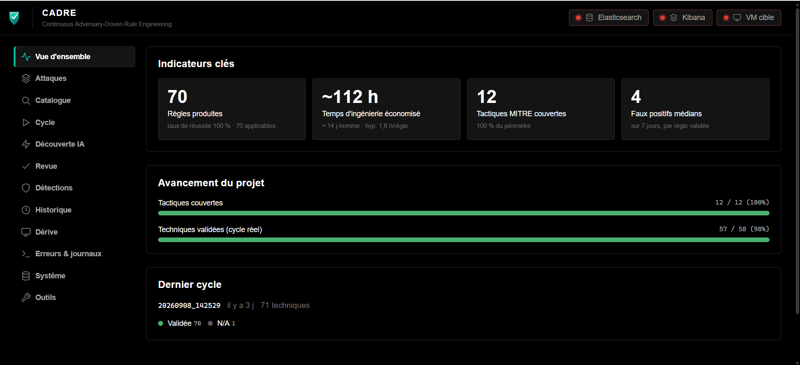
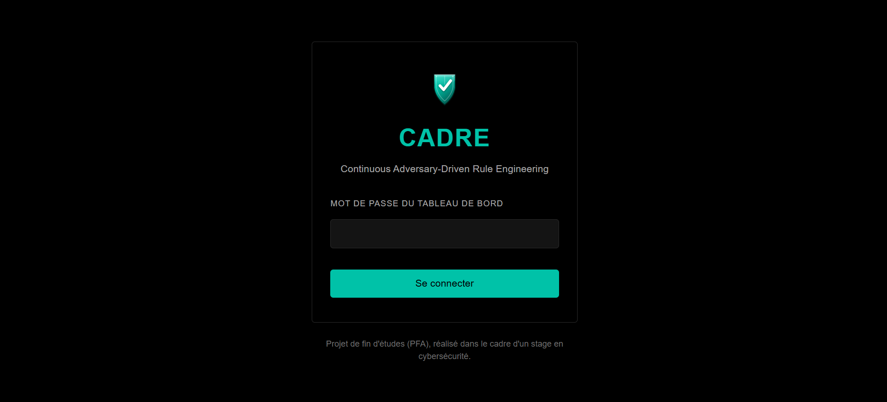
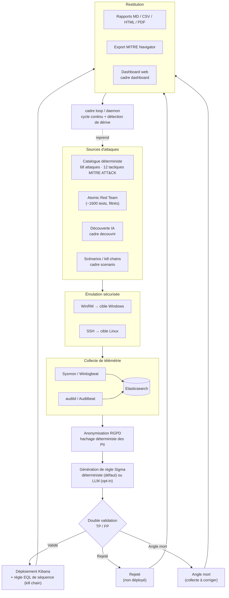
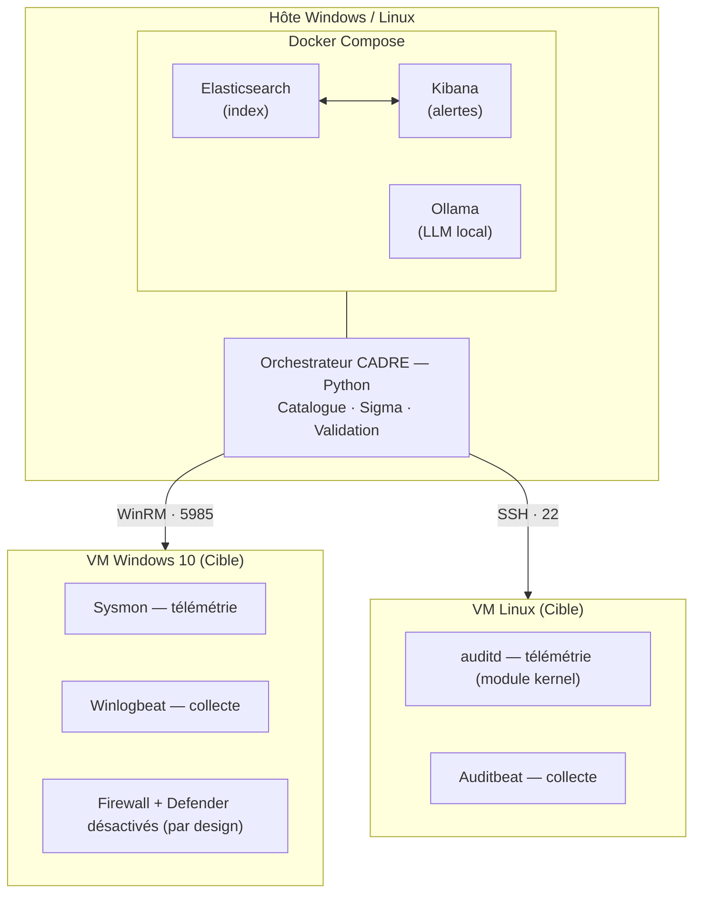
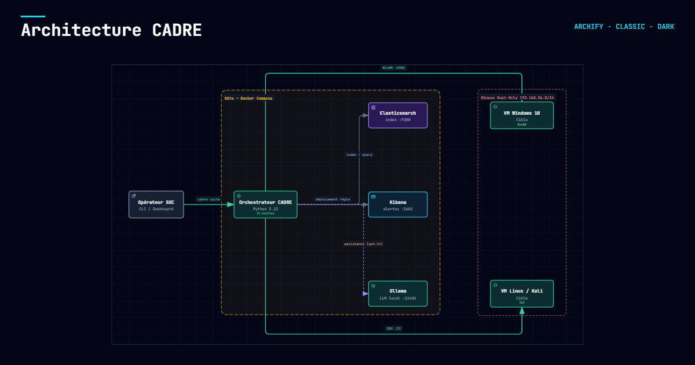

# CADRE — Continuous Adversary-Driven Rule Engineering

<div align="center">


### Audit SOC automatisé · MITRE ATT&CK · Sigma

**CADRE automatise l'audit de votre SOC en émulant des techniques MITRE ATT&CK
de manière sûre, en collectant la télémétrie, et en générant, validant et
déployant automatiquement des règles de détection Sigma dans Kibana.**

[](https://github.com/Mohamed-Amine-Eddari/CADRE/actions/workflows/cadre-ci.yml)
[](https://www.gnu.org/licenses/agpl-3.0)
[](https://www.python.org/downloads/)
[](https://github.com/psf/black)

</div>

> **Qualité vérifiée** (CI GitHub Actions confirmée verte) :
> `pytest` (1168 tests, couverture 93,61 %), `ruff`, `black`, `mypy`, `bandit`,
> `pip-audit`, `detect-secrets` — reproductible avec `make ci`.

> **Statut du projet** : projet de fin d'études (PFA), réalisé dans le
> cadre d'un stage en cybersécurité. Ceci n'est pas un produit officiel.

---

## Nouveau sur ce projet ?

Lis [`docs/GUIDE_PROJET.md`](docs/GUIDE_PROJET.md) — un guide complet
qui explique le problème résolu, les concepts nécessaires (SOC, MITRE
ATT&CK, Sigma, TP/FP...), le fonctionnement pas à pas du pipeline, et le
rôle de chaque fichier du code. C'est le meilleur point d'entrée pour
comprendre CADRE de A à Z.

---

## Pourquoi CADRE ?

Les organisations font face à **trois défis critiques** dans la gestion de leur SOC :

1. **Angles morts permanents** — Les règles de détection ne couvrent jamais 100% de MITRE ATT&CK. Un attaquant n'a qu'à utiliser une technique non couverte pour passer inaperçu.

2. **Dérive temporelle** — Les règles deviennent obsolètes à mesure que les attaquants font évoluer leurs TTPs. Une règle écrite il y a 18 mois peut être contournée aujourd'hui.

3. **Coût humain prohibitif** — Un ingénieur détection écrit en moyenne 5 règles/jour. Pour un SOC de taille moyenne, c'est plusieurs mois-homme par an.

**CADRE répond à ces trois défis** en automatisant la création, la validation et le déploiement continu de règles de détection, chaque règle étant **prouvée par une double validation TP/FP** avant tout déploiement.

> **Portée et limite (à lire honnêtement).** CADRE automatise et **prouve**
> le *cycle d'ingénierie de détection* de bout en bout. Sur le **contenu**
> produit, après un travail de fond *TTP-first* (privilégier un indicateur
> réel de la technique plutôt qu'un signal générique) :
> **54 des 68 règles (79 %) détectent un indicateur réel de la technique**
> (`systeminfo.exe`, `certutil -decode`, `rundll32`,
> `net localgroup administrators`, `LogonType` réseau pour le mouvement
> latéral, `-perm -4000`/`sudo -l` pour la reconnaissance de privilège
> escalade Linux…) ; **12 (18 %) sont honnêtement étiquetées « validation de
> pipeline »** dans le code lui-même (télémétrie pure, sans contenu
> malveillant à généraliser) ; **2 (3 %) sont volontairement génériques**
> (`event.code` seul, événements d'audit Windows natifs). CADRE valide donc
> aujourd'hui le **cycle d'ingénierie**
> de bout en bout, avec un contenu de détection majoritairement réel — pas
> encore 100 % production-ready sur les 18 % restants, assumé.

---

## Pour qui ?

| Vous êtes... | CADRE vous sert à... |
|---|---|
| **Étudiant en cybersécurité** | Apprendre l'ingénierie de détection en pratique — chaque règle est reliée à une attaque réelle et à une preuve TP/FP, pas à un exercice théorique. |
| **Blue team / analyste SOC** | Mesurer la couverture de détection réelle de votre stack Elastic/Kibana face à MITRE ATT&CK, sans deviner ce qui est réellement détecté. |
| **Red team / purple team** | Rejouer un catalogue d'attaques homologué (dont Atomic Red Team filtré) de façon reproductible, avec preuve automatique de ce qui a été vu côté défense. |
| **Étudiant en projet de fin d'études** | Une base de référence pour un projet similaire : pipeline complet, tests, CI, documentation — à forker et adapter (licence AGPL-3.0). |

**Avant de vous lancer, un point honnête** : CADRE n'est pas un outil
« clone et lance » — c'est un outil de laboratoire qui suppose une vraie
infrastructure (2 VM + une stack Docker, 8-16 Go de RAM). Pour essayer le
pipeline sans rien installer côté VM, utilisez `--simulate` (voir plus
bas) ; pour comprendre les concepts avant de vous lancer,
[`docs/GUIDE_PROJET.md`](docs/GUIDE_PROJET.md) explique tout pas à pas,
même si le SOC/MITRE ATT&CK/Sigma vous sont inconnus.

---

## Fonctionnalités

- **Catalogue déterministe** de 68 attaques MITRE ATT&CK (46 Windows + 22 Linux) couvrant 12 tactiques dans le périmètre (Initial Access, Execution, Persistence, Discovery, Credential Access, Lateral Movement, Defense Evasion, Exfiltration, Command and Control, Impact, Privilege Escalation, Collection) — **multi-OS** (Windows via WinRM, Linux via SSH)
- **Émulation sécurisée** via WinRM avec mode silencieux
- **Scénarios d'adversaire (kill chains)** — enchaîne des attaques en campagnes réalistes (ransomware, vol d'identifiants, reconnaissance, intrusion Linux) et mesure la **couverture de détection phase par phase**. Va plus loin qu'un émulateur : CADRE joue la chaîne **et** homologue la détection de chaque étape (`cadre scenario`).
- **Corrélation de kill chain (Kibana, scénarios Windows)** — au-delà des règles individuelles, déploie une règle **EQL de séquence** qui se déclenche quand les étapes détectées d'un scénario s'enchaînent sur le même hôte dans l'ordre attendu (`sequence by host.name`) — un signal plus fort qu'une alerte isolée, prouvée sur données réelles (fenêtre dérivée de la durée mesurée du scénario, jamais devinée). Un angle mort au milieu de la chaîne interrompt la corrélation plutôt que de la faire échouer silencieusement.
- **Détection de règles à logique quasi-identique** — repère les attaques du catalogue dont la règle générée serait fonctionnellement un doublon (même EventID, même indicateur) malgré des noms différents — au-delà de la déduplication par nom déjà appliquée au déploiement (`cadre stats`).
- **Score de confiance par règle** (0-100, exporté dans chaque CSV de cycle) — combine la catégorie TTP-first de l'attaque (indicateur réel / validation de pipeline / générique) et la marge réelle par rapport au seuil de bruit calibré, sans nouvelle mesure : une lecture combinée de données déjà produites par la double validation TP/FP.
- **Détection de dérive de règle** (`cadre derive <ID>`) — compare la validation la plus récente d'une attaque à sa première mesure historique connue sur les cycles archivés, pour repérer qu'une règle déjà déployée se dégrade (perte de détection, dérive de bruit) sans attendre qu'elle finisse par échouer en silence.
- **Ingestion Atomic Red Team** — branche la bibliothèque communautaire (~1600 tests) comme **source d'attaques**. Chaque atomic passe le **filtre de sécurité** de CADRE (les tests destructeurs sont refusés avant toute exécution), est converti au modèle CADRE, puis **validé** par le pipeline. La source est homologuée, jamais exécutée aveuglément (`cadre atomic`).
- **Double validation TP/FP** avant tout déploiement
- **Anonymisation RGPD-by-design** (hashing déterministe des PII)
- **Coffre-fort système** pour les credentials (Windows Credential Manager, macOS Keychain)
- **Rapports automatiques** Markdown + CSV + HTML autonome
- **Export MITRE ATT&CK Navigator** (layer JSON) pour visualiser la couverture réelle en heatmap
- **Dashboard web local** (`cadre dashboard`) — poste de pilotage complet : cycles exécutés, état de la stack, catalogue, secrets, découverte IA (équivalent de `cadre decouvrir`), file de revue humaine (approuver/rejeter une règle IA avant déploiement Kibana), outils (raffiner une attaque, exporter Sigma, éditer/pousser une règle déployée, ingérer Atomic Red Team, valider une règle Sigma externe), et lancement de cycle en simulation ou réel (confirmation explicite requise pour un cycle réel). Sans authentification en local (`127.0.0.1`) ; pour un usage en équipe (`--bind` non-loopback), authentification HTTP Basic obligatoire (`CADRE_DASHBOARD_PASSWORD`, verrouillage anti-brute-force) — un reverse-proxy TLS reste nécessaire pour un vrai déploiement réseau
- **Logger JSON structuré** pour forensic
- **Docker Compose** pour un déploiement en 1 commande
- **Assistant IA locale (Ollama)** — brouillons de nouvelles attaques, synthèses de rapports en langage naturel, et (optionnel, `--ia-draft-regles`) un brouillon de règle Sigma comparatif par attaque, affiché à côté de la règle déterministe dans le rapport ; jamais dans le chemin de génération/validation/déploiement des règles, qui reste 100% déterministe. Pas de dépendance cloud, pas de fuite de données.
- **Tests unitaires** + **CI/CD** prêt à l'emploi

---

## Captures d'écran

<p align="center">
  
</p>

<p align="center">
  
</p>

---

## Comment ça marche — vue d'ensemble du pipeline



*Chaque attaque suit ce chemin individuellement ; `cadre loop`/`cadre daemon`
le répète en continu sur le catalogue, avec `cadre derive` qui compare
chaque nouvelle validation à l'historique pour repérer une règle déployée
qui se dégrade.*

---

## Architecture



<p align="center">
  
</p>

Version interactive (vues nommées, thèmes clair/sombre, export) :
[`docs/_static/diagrams/cadre-architecture.html`](docs/_static/diagrams/cadre-architecture.html)
— téléchargez-le et ouvrez-le dans un navigateur (fichier autonome, aucune
dépendance réseau).

---

## Démarrage rapide (5 minutes)

### Prérequis

- **Docker Desktop** avec WSL2 (Windows) ou Docker Engine (Linux)
- **Python 3.11+**
- **VirtualBox** avec une VM Windows 10
- **8 Go RAM minimum** (16 Go recommandé pour faire tourner 2 VM + Docker)

### Installation

```bash
# 1. Cloner le dépôt
git clone https://github.com/Mohamed-Amine-Eddari/CADRE.git
cd CADRE

# 2. Installer les dépendances
pip install -r requirements.txt
pip install -e .

# 3. Démarrer la stack Elastic + Kibana + Ollama
docker compose up -d

# 4. Configurer les credentials (mode interactif)
cadre init

# 5. Vérifier la stack
cadre status

# 6. Lancer un cycle d'audit
cadre cycle
```

### Premier audit ciblé

```bash
# Auditer uniquement les techniques de persistance
cadre cycle --technique T1136.001 T1053.005

# Auditer une attaque unique
cadre cycle --id CADRE-PER-001
```

> **Démo sans VM (plan de repli).** Ajoutez `--simulate` pour exécuter tout le
> pipeline (génération de règle, compilation Sigma, rapports) **sans toucher la VM
> ni le SIEM** — utile pour une démonstration si l'environnement live n'est pas
> disponible :
> ```bash
> cadre cycle --id CADRE-DIS-001 --simulate      # statut SIMULE, aucun accès réseau
> cadre scenario --id RANSOMWARE --simulate      # kill chain complète en simulation
> ```

---

## Commandes CLI

| Commande | Description |
|----------|-------------|
| `cadre init` | Initialise la configuration (mode interactif) |
| `cadre init --set CLE=VALEUR` | Définit un secret sans interaction |
| `cadre init --list` | Liste les secrets configurés (jamais leurs valeurs) |
| `cadre cycle` | Exécute un cycle d'audit complet |
| `cadre cycle --technique T1059.001` | Limite à certaines techniques |
| `cadre cycle --id CADRE-PER-001` | Exécute une seule attaque |
| `cadre scenario --list` | Liste les scénarios d'adversaire (kill chains) |
| `cadre scenario --id RANSOMWARE` | Émule une kill chain complète et mesure sa couverture de détection |
| `cadre atomic` | Aperçu des tests Atomic Red Team ingérables (filtrés pour sécurité) |
| `cadre atomic --repo <chemin> --import` | Importe les atomics sûrs au catalogue (utilisables par cycle/scenario) |
| `cadre cycle --llm` | Enrichit le rapport d'une synthèse IA (Ollama, optionnel) |
| `cadre cycle --ia-draft-regles` | Ajoute un brouillon de règle Sigma par IA, comparatif uniquement (jamais déployé) |
| `cadre loop` | Boucle automatisée : exécute des cycles en continu, avec rotation des techniques et alertes email optionnelles |
| `cadre daemon` | Lance CADRE en arrière-plan avec fichier PID (cycles répétés, non-interactif) |
| `cadre status` | Vérifie l'état de la stack |
| `cadre list` | Liste les attaques du catalogue |
| `cadre stats` | Affiche les statistiques du catalogue |
| `cadre valider-regle FICHIER` | Valide une règle Sigma **externe** existante (ex. SigmaHQ) sur votre propre télémétrie |
| `cadre rapport --soutenance` | Génère le rapport de soutenance PFA |
| `cadre suggest -d "description"` | Brouillon d'attaque assisté par IA (à valider avant ajout au catalogue) |
| `cadre decouvrir` | Agent IA autonome : l'IA propose de nouvelles attaques que CADRE exécute et valide (complète le catalogue) |
| `cadre dashboard` | Dashboard web local : cycles, état de la stack, catalogue, secrets, découverte IA, lancement de cycle (simulation ou réel) |
| `cadre metrics` | Expose les métriques au format Prometheus |
| `cadre metriques` | Affiche la valeur métier du dernier cycle (temps gagné, couverture) — à ne pas confondre avec `cadre metrics` ci-dessus |
| `cadre metriques --cumul` | Valeur métier cumulée sur tous les cycles de `cadre loop` (temps gagné cumulé) |
| `cadre derive <ID>` | Détecte si une règle déjà validée se dégrade dans le temps (perte de détection ou dérive de bruit), en comparant sa mesure la plus récente aux cycles archivés |
| `cadre export-sigma` | Exporte les règles validées du catalogue au format Sigma partageable |
| `cadre revue lister` | Liste les règles IA validées TP/FP mais en attente de revue humaine avant déploiement |
| `cadre revue approuver <rule_id>` | Déploie dans Kibana une règle en attente de revue |
| `cadre revue rejeter <rule_id>` | Rejette une règle en attente de revue (jamais déployée) |
| `cadre regle lire <rule_id>` | Affiche le YAML d'une règle déjà déployée dans Kibana |
| `cadre regle editer <rule_id>` | Édite localement le YAML d'une règle déployée avant de la repousser |
| `cadre regle pousser <rule_id>` | Repousse une règle éditée dans Kibana, revalidée TP/FP avant mise à jour |
| `cadre raffiner <ID>` | Ajuste le seuil de faux positifs ou la valeur de détection d'une attaque existante, sans dupliquer la règle |
| `cadre rechercher <mot_clé>` | Cherche une technique dans le catalogue natif/perso et Atomic Red Team |

---

## Sécurité

CADRE traite des données sensibles (logs, credentials, identifiants Windows).
Avant un déploiement en production, consultez :

- [`docs/SECURITY.md`](docs/SECURITY.md) — Modèle de menace, bonnes pratiques
- [`docs/ARCHITECTURE.md`](docs/ARCHITECTURE.md) — Architecture détaillée
- [`docs/INSTALL.md`](docs/INSTALL.md) — Installation pas à pas
- [`docs/THREAT_MODEL.md`](docs/THREAT_MODEL.md) — Modèle de menace formel

**Règles absolues** :
- Aucun secret ne doit être committé dans Git
- Aucun secret ne doit être loggé en clair
- Toute utilisation doit être autorisée par écrit
- Testez uniquement sur des systèmes que vous possédez

**Vulnérabilité connue suivie** : `PYSEC-2026-2447` (`diskcache`, dépendance
transitive de pySigma) — CVSS 5,2/10 (Moyen), vecteur **local** uniquement,
aucun correctif amont disponible à ce jour. Risque limité par l'environnement
de labo isolé (VM host-only, sans accès Internet). Détail et mitigation :
[`docs/SECURITY.md`](docs/SECURITY.md), section « Mises à jour et audit des
dépendances ».

---

## Tests

```bash
# Tests unitaires
pytest tests/ -v

# Tests avec couverture
pytest tests/ --cov=cadre --cov-report=html

# Scan de sécurité du code
bandit -r src/

# Vérification des dépendances vulnérables (pip-audit remplace safety, cf. docs/SECURITY.md)
pip-audit -r requirements.txt --desc --ignore-vuln PYSEC-2026-2447
```

---

## Contribution

Les contributions sont les bienvenues ! Lisez [`CONTRIBUTING.md`](CONTRIBUTING.md) avant de proposer une PR.

Pour ajouter une attaque au catalogue :
1. Ajoutez l'entrée dans `src/cadre/catalogue_attaques.py`
2. Ajoutez un test dans `tests/test_catalogue.py`
3. Lancez `pytest tests/test_catalogue.py`
4. Documentez dans `docs/ARCHITECTURE.md`

---

## Licence

**AGPL-3.0** — voir [`LICENSE`](LICENSE) (texte intégral) et
[`LICENSE-SUMMARY.md`](docs/LICENSE-SUMMARY.md) (résumé non-officiel, sans
valeur légale).

CADRE peut être utilisé librement, y compris commercialement, **à condition que
toute modification du code source soit publiée sous la même licence** (copyleft fort).

Pour une licence commerciale sans copyleft, contactez l'auteur.

---

## Auteur

**Mohamed Amine EDDARI** — Étudiant en école d'ingénierie
eddarimedamine@gmail.com
[github.com/Mohamed-Amine-Eddari](https://github.com/Mohamed-Amine-Eddari)
PFA 2026

---

## Remerciements

- **MITRE ATT&CK** — Pour le framework de référence
- **SigmaHQ** — Pour le format de règles standardisé
- **Elastic** — Pour la stack ELK open-source
- **Atomic Red Team** — Pour l'inspiration des tests
- **Ollama** — Pour l'exécution locale de LLM
