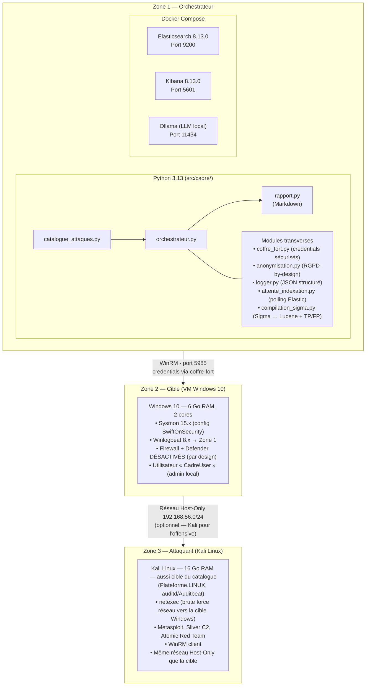
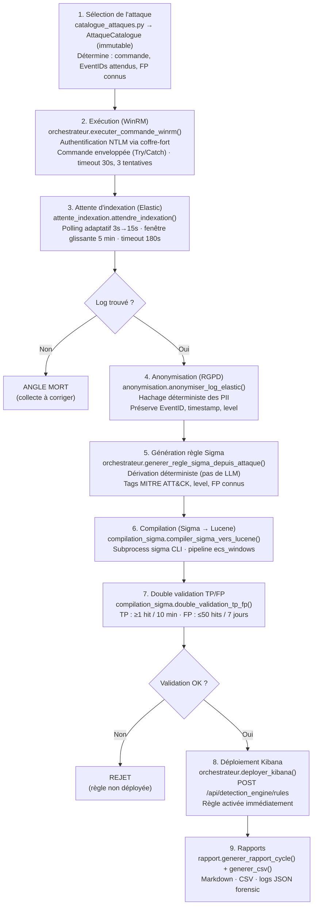

# Architecture technique CADRE

> Document destiné aux ingénieurs sécurité et DevSecOps qui doivent comprendre,
> maintenir et faire évoluer CADRE en production.

## Vue d'ensemble

CADRE est un **pipeline CI/CD de détection** composé de 4 zones isolées et d'un
cerveau central qui orchestre leur interaction. La conception privilégie :

- **Déterminisme** : chaque étape est reproductible
- **Isolation** : une compromission de la cible ne peut pas remonter à l'orchestrateur
- **Observabilité** : tous les événements sont loggés en JSON structuré
- **Robustesse** : les pannes partielles ne font pas tomber tout le cycle

---

## Diagramme des composants



Historiquement cette zone n'était qu'un diagramme sans code correspondant
(voir `CHANGELOG.md` : « le catalogue déterministe... exécuté directement
depuis l'hôte via WinRM, est le seul vecteur d'attaque »). Ce n'est plus le
cas : `AttaqueCatalogue.origine_execution = OrigineExecution.KALI`
(`catalogue_attaques.py`) fait exécuter la commande d'attaque
RÉELLEMENT sur cette VM (SSH, `orchestrateur.executer_commande_ssh_kali`),
qui vise alors la cible Windows par le réseau -- la télémétrie et la
validation TP/FP restent cherchées côté Windows, inchangées. Voir
`CADRE-CRE-006` (brute force WinRM T1110.001, `winlogbeat-*`).

### Modules non représentés ci-dessus (interfaces, IA, sources d'attaques)

Le diagramme montre le **cœur du cycle par attaque** (8 modules). `src/cadre/`
compte réellement **24 modules** (hors `__init__.py`) — les 16 restants sont
soit des **points d'entrée** qui pilotent le cycle depuis l'extérieur, soit
des **sources d'attaques additionnelles**, soit des utilitaires transverses :

| Module | Rôle | Relation réelle (imports vérifiés) |
|---|---|---|
| **`cli.py`** (1926 lignes) | Point d'entrée principal (`cadre <commande>`) | Importe `orchestrateur`, `boucle`, `decouverte_ia`, `atomic_red_team`, `export_sigma`, `dashboard` (pour `cadre dashboard`) — c'est lui qui déclenche tout le reste |
| **`dashboard.py`** (~1886 lignes) | Serveur web local (lecture rapports + lancement de cycles + revue humaine + outils (raffiner/export Sigma/édition de règle/Atomic Red Team/validation de règle externe) + authentification HTTP Basic optionnelle) | Importe `orchestrateur`, `catalogue_attaques`, `catalogue_utilisateur`, `coffre_fort`, `assistant_llm`, `decouverte_ia`, `metriques` (imports différés, `# noqa: PLC0415`, pour garder le démarrage du serveur léger) |
| **`assistant_llm.py`** (466 lignes) | Client Ollama local — couche d'assistance uniquement | Appelé par `orchestrateur` (opt-in), `dashboard`, `decouverte_ia`, `cli` (`cadre suggest`) — jamais l'inverse : ne décide jamais, ne bloque jamais le pipeline déterministe |
| **`decouverte_ia.py`** (222 lignes) | Agent de découverte autonome (encadré, 4 garde-fous) | Appelle `assistant_llm` (génère le brouillon) puis `orchestrateur.executer_attaque_complete` (exécution réelle, même chemin que le catalogue natif ; `revue=True` → s'arrête avant déploiement, voir `revue_regles.py`) et `catalogue_utilisateur` (conservation si validée) |
| **`revue_regles.py`** (127 lignes) | File d'attente de revue pré-déploiement (`~/.cadre/revues_en_attente.json`) | Alimentée par `orchestrateur.executer_attaque_complete(arreter_avant_deploiement=True)` ; lue/vidée par `cli` (`cadre revue lister/approuver/rejeter`) — jamais consultée par le cycle normal |
| **`recherche.py`** (107 lignes) | Recherche par mot-clé (catalogue natif + personnel + Atomic Red Team) | Réutilise `atomic_red_team.importer_atomics` (même filtre) ; appelée par `cli` (`cadre rechercher`), qui relaie vers `decouverte_ia` (`revue=True` forcé, jamais désactivable) si rien n'est trouvé |
| **`boucle.py`** (320 lignes) | Boucle automatisée avec rotation (`cadre loop`) | Pilote `orchestrateur.OrchestrateurCADRE` en cycles répétés ; lit `catalogue_attaques` pour la sélection. `_boucle_attaques` embarque un **disjoncteur** (circuit breaker) : au-delà de `seuil_echecs_execution_consecutifs` (défaut 5) échecs d'exécution consécutifs (ex. service WinRM devenu "zombie"), le cycle s'interrompt proprement plutôt que de s'acharner sur les attaques restantes |
| **`scenarios.py`** (234 lignes) | Kill chains (enchaînements de techniques déjà cataloguées) | Compose uniquement des `AttaqueCatalogue` existantes (`catalogue_attaques`) — n'invente aucune commande, ordonnance seulement |
| **`atomic_red_team.py`** (343 lignes) | Ingestion filtrée d'Atomic Red Team comme source d'attaques | Réutilise **le même filtre** `decouverte_ia.commande_dangereuse` que l'agent IA — une source externe non maîtrisée passe par la même barrière qu'une attaque générée par IA |
| `catalogue_utilisateur.py` | Catalogue personnel (attaques ajoutées via `cadre suggest --enregistrer` ou l'agent IA) | Étend `catalogue_attaques.CATALOGUE`, jamais modifié directement |
| `raffinement.py` | Ajuste une attaque EXISTANTE en place (paramètres de détection/bruit uniquement, jamais l'identité) | Overlay JSON (`~/.cadre/raffinements.json`) appliqué par `orchestrateur` au cycle suivant sur la même `rule_id_stable` — met à jour la règle Kibana en place, ne la duplique jamais |
| `export_sigma.py` | Export des règles au format Sigma partageable | Importe `compilation_sigma`, `orchestrateur` (imports différés) |
| `metriques.py` | Endpoint Prometheus (`cadre metrics`) | Lit les rapports produits par `rapport.py` ; importe `catalogue_attaques` pour les totaux |
| `reseau.py` | Vérification TLS centralisée | Utilisé par `orchestrateur` pour tous les appels HTTP sortants (Elastic/Kibana) |
| `validation_regle.py` | Validation d'une règle Sigma existante contre la télémétrie de l'utilisateur (`cadre valider-regle`) | Réutilise `compilation_sigma.double_validation_tp_fp` — même moteur de preuve que le cycle normal |
| `synchronise_secrets.py` | Repousse `CADRE_ELASTIC_PASS` vers Winlogbeat/Auditbeat après rotation (`cadre secrets-sync-beats`) | Utilise `orchestrateur` (WinRM/SSH) pour déposer le nouveau mot de passe sans jamais le faire transiter par un argument de ligne de commande |

---

## Flux de données détaillé

### Cycle d'audit d'une attaque



---

## Modèle de données

### Structure d'une attaque (catalogue)

```python
@dataclass(frozen=True)
class AttaqueCatalogue:
    id: str                          # "CADRE-EXE-001"
    nom: str                        # "PowerShell - Discovery"
    description: str                # Description lisible
    technique_mitre: str            # "T1059.001"
    tactique_mitre: str             # "Execution"
    sous_technique: Optional[str]   # "PowerShell"
    commande: str                   # Commande exacte
    event_ids_attendus: List[str]   # ["4104", "4688"]
    champ_principal: str            # "process.command_line"
    faux_positifs_connus: List[str] # Liste de patterns à ignorer
    niveau_risque: NiveauRisque     # FAIBLE / MOYEN / ELEVE
    plateforme: Plateforme          # WINDOWS / LINUX / MIXTE
    references: List[str]           # URLs MITRE
    prerequisites: List[str]        # Conditions requises
    duree_estimee_sec: int          # 5
```

### Structure d'un résultat

```python
{
    "timestamp": "2026-07-16T20:30:00",
    "id": "CADRE-PER-001",
    "technique_mitre": "T1136.001",
    "tactique": "Persistence",
    "description": "Création de compte utilisateur",
    "event_ids_attendus": ["4720", "4726"],
    "statut": "VALIDE",  # ou REJETE, ANGLE_MORT, ERREUR
    "raison": "Règle générée, validée et déployée",
    "regle_sigma_yaml": "...",  # Si applicable
    "requete_lucene": "...",    # Si applicable
    "nb_tp": 1,                 # Vrais positifs
    "nb_fp": 3,                 # Faux positifs
    "raison_validation": "OK"
}
```

---

## Sécurité de l'orchestrateur

### Isolation

- L'orchestrateur **n'a JAMAIS accès à Internet** en phase d'exécution
- Les seules connexions sortantes sont : Docker (local), WinRM (Host-Only)
- L'API LLM est 100% locale (Ollama)

### Gestion des secrets

| Secret | Stockage |
|--------|----------|
| `CADRE_VM_PASS` | Windows Credential Manager (keyring) |
| `CADRE_ELASTIC_PASS` | Windows Credential Manager (keyring) |
| `CADRE_KIBANA_TOKEN` | Windows Credential Manager (keyring) |

**Aucun secret n'est jamais** :
- Commité dans Git
- Loggé en clair
- Stocké dans le code source
- Transmis sur un canal non chiffré

### Anonymisation

Avant tout envoi au LLM ou tout stockage long terme :

| Type de PII | Traitement |
|-------------|-----------|
| Adresse IPv4 | `192.168.1.100` → `[IPV4_ANONYMISE]` |
| Adresse IPv6 | `fe80::1` → `[IPV6_ANONYMISE]` |
| Email | `alice@corp.com` → `[EMAIL_ANONYMISE]` |
| Username | `CORP\alice` → `[DOMAIN_ANONYMISE]\ANON-XXX` |
| Hash MD5/SHA | `5d41402abc...` → `[MD5_ANONYMISE]` |
| Token Bearer | `Bearer abc...` → `[BEARER_TOKEN_ANONYMISE]` |
| Password | `pwd=secret` → `pwd=[PASSWORD_ANONYMISE]` |

**Hachage déterministe** : même IP = même hash (corrélation préservée, irréversibilité garantie).

---

## Performance et scalabilité

### Métriques typiques

| Métrique | Valeur |
|----------|--------|
| Durée d'un cycle complet (62 attaques), séquentiel | 17 min 45 s (mesuré) |
| Durée d'un cycle complet (62 attaques), `--parallel` (G2) | 9 min 51 s (mesuré) |
| Durée d'un cycle complet (65 attaques, après ajout Privilege Escalation), séquentiel | 18 min 27 s (mesuré, 2026-08-12) |
| Durée d'un cycle complet (65 attaques), `--parallel` | 11 min 36 s (mesuré, 2026-08-12, ~37 % plus rapide) |

*Tailles de catalogue ci-dessus = taille au moment de chaque mesure (catalogue
actuel : 68 attaques — voir `GUIDE_PROJET.md`) ; non ré-exécuté depuis faute
de labo VM disponible dans cet environnement.*
| Délai moyen d'indexation | 5-15s |
| Génération d'une règle Sigma | < 1s |
| Compilation Sigma → Lucene | 2-5s |
| Double validation TP/FP | 1-3s |
| Déploiement Kibana | < 1s |

**Parallélisme prudent (G2, `cadre cycle --parallel`)** : borné à 2 exécutions
WinRM/validations simultanées (jamais plus — décision explicite), opt-in,
jamais activé par `--demo` ni
`cadre scenario` (qui dépend d'un ordre chronologique réel pour la
corrélation EQL). Le catalogue est partitionné en lots
(`partitionner_pour_parallelisme`,
`src/cadre/catalogue_attaques.py`) de façon à ce qu'aucune paire dans un
même lot ne puisse contaminer la fenêtre de validation TP
(`now-600s`) d'une autre : les règles génériques (`event.code` seul)
restent toujours isolées, de même que deux règles dont les valeurs de
corrélation textuelle se chevauchent. Réduit la durée du cycle complet
d'environ 45 % dans cet environnement de labo, sans dégradation de fiabilité
observée (0 erreur, 0 angle mort sur le run de vérification).

### Limites connues

- **Catalogue limité** : 68 attaques couvrent 12/14 tactiques MITRE ATT&CK
  dans le périmètre et 56 techniques uniques — sur les 823+
  techniques/sous-techniques du référentiel complet, une fraction reste hors
  catalogue. Seules Reconnaissance et Resource Development restent hors
  périmètre **par conception** : ce sont des tactiques entièrement côté
  attaquant (OSINT, scan externe, achat d'infrastructure, développement de
  malware) — aucune commande, même exécutée depuis Kali, ne peut y générer
  de télémétrie observable sur la cible. Initial Access était exclue pour
  une raison différente ("la quasi-totalité du catalogue s'exécute *sur* la
  cible, ce qui présuppose déjà l'accès initial"), mais cette raison est
  devenue caduque avec `OrigineExecution.KALI` : `CADRE-CRE-006` (T1110.001,
  Credential Access) prouve d'abord l'exécution réseau réelle depuis Kali,
  et `CADRE-INI-001` (T1133, External Remote Services) réutilise ce même
  mécanisme avec un identifiant déjà valide pour couvrir réellement Initial
  Access.
- **Linux implémenté** (pas une roadmap) : exécution SSH
  (`orchestrateur.executer_commande_ssh`), 22 attaques ciblant Linux (20
  `CADRE-LIN-*` + `CADRE-PRI-002`/`003`, Privilege Escalation), compilées
  avec un pipeline pySigma dédié (`"aucun"`, identité — pas le pipeline
  `ecs_windows`), sélectionné selon la plateforme de la cible
  (`orchestrateur.py`)
- **Mono-SIEM** : Elastic uniquement (Wazuh, Splunk en roadmap)
- **Mono-VM** : 1 cible à la fois (multi-VM en roadmap)
- **Dépendance transitive vulnérable, non corrigeable côté CADRE** :
  `diskcache` (tiré par `pySigma`, utilisé uniquement pour mettre en cache
  les données MITRE ATT&CK lors de l'export Kibana — jamais pour de la
  télémétrie de la cible) désérialise via `pickle` par défaut
  (`PYSEC-2026-2447`, CVSS 5.2 medium) : un attaquant avec un accès en
  écriture au cache local de la machine d'analyse pourrait y exécuter du
  code arbitraire. Aucune version corrigée publiée en amont à ce jour.
  Exposition jugée faible dans ce labo (nécessite déjà un accès local à la
  machine d'analyse, un scénario où d'autres vecteurs seraient plus
  directs) mais signalé honnêtement plutôt que caché ; à surveiller
  (`pip-audit`) jusqu'à correctif amont.

---

## Évolutions futures

> Deux entrées de ce tableau (Support Linux, Interface web) figuraient
> encore ici comme roadmap alors qu'elles sont **déjà livrées** (20
> attaques Linux via SSH/auditd depuis la v1.5.0 ; `cadre dashboard`
> depuis plus tôt encore) — corrigé. Backlog réévalué le 2026-08-11,
> priorisé par ce qui est vérifiable en conditions réelles dans cet
> environnement de labo (Elastic/Kibana) vs ce qui nécessiterait un accès
> à un système externe non disponible ici (Splunk, Sentinel, Wazuh, Jira,
> ServiceNow) pour être prouvé avant d'être livré.

> **Authentification dashboard : livrée (2026-08-14)**, retirée de ce
> tableau. HTTP Basic Auth (`CADRE_DASHBOARD_PASSWORD`, coffre-fort,
> comparaison en temps constant), obligatoire dès que `--bind` n'est pas
> loopback, verrouillage anti-brute-force par IP — prouvée en conditions
> réelles (401/401/200 + verrouillage après 5 échecs, vraies requêtes
> HTTP). Limite assumée : Basic Auth encode, ne chiffre pas — un
> reverse-proxy TLS reste requis pour un vrai déploiement réseau, CADRE
> ne le fournit pas lui-même.

| Priorité | Fonctionnalité | Effort | Bloqué par |
|----------|----------------|--------|------------|
| Haute | Multi-SIEM (Splunk, Sentinel, Wazuh) — export déjà multi-format (Lucene/ES-DSL/Kibana ndjson), il manque les backends de déploiement direct | 4-6 semaines | Aucune instance Splunk/Sentinel/Wazuh disponible pour vérifier en réel |
| Moyenne | Intégration ticketing (Jira, ServiceNow) pour les angles morts détectés | 1-2 semaines | Aucune instance Jira/ServiceNow disponible pour vérifier en réel — délibérément pas construite sans preuve réelle possible (même principe que le reste du projet) |
| Basse | Support Kubernetes | 4-6 semaines | — |
| Basse | Publication marketplace Sigma | 2 semaines | — |

---

## Annexes

### A. Schéma Elasticsearch (extrait)

```json
{
  "@timestamp": "2026-07-16T20:30:00.000Z",
  "agent": { "type": "winlogbeat", "version": "8.13.0" },
  "event": {
    "code": 4720,
    "kind": "event",
    "category": ["iam"],
    "action": "created-user-account",
    "outcome": "success"
  },
  "host": { "name": "CADRE-Victim", "os": { "family": "windows" } },
  "user": { "name": "alice", "domain": "CORP" },
  "process": {
    "name": "net.exe",
    "command_line": "net user test /add"
  }
}
```

### B. Mapping recommandé pour Elastic

```json
PUT _index_template/winlogbeat-template
{
  "index_patterns": ["winlogbeat-*"],
  "template": {
    "mappings": {
      "properties": {
        "event.code": { "type": "keyword" },
        "process.command_line": { "type": "text" },
        "user.name": { "type": "keyword" },
        "@timestamp": { "type": "date" }
      }
    }
  }
}
```

### C. Variables d'environnement

| Variable | Défaut | Description |
|----------|--------|-------------|
| `CADRE_VM_IP` | `192.168.56.104` | IP de la VM cible |
| `CADRE_VM_USER` | `CadreUser` | Utilisateur WinRM |
| `CADRE_VM_PASS` | (requis) | Mot de passe (coffre) |
| `CADRE_ELASTIC_URL` | `http://127.0.0.1:9200` | URL Elasticsearch |
| `CADRE_ELASTIC_USER` | `elastic` | Utilisateur Elastic |
| `CADRE_ELASTIC_PASS` | (requis) | Mot de passe (coffre) |
| `CADRE_KIBANA_URL` | `http://127.0.0.1:5601` | URL Kibana |
| `CADRE_TIMEOUT_INDEXATION` | `180` | Secondes |
| `CADRE_SEUIL_FP` | `50` | Faux positifs max |
