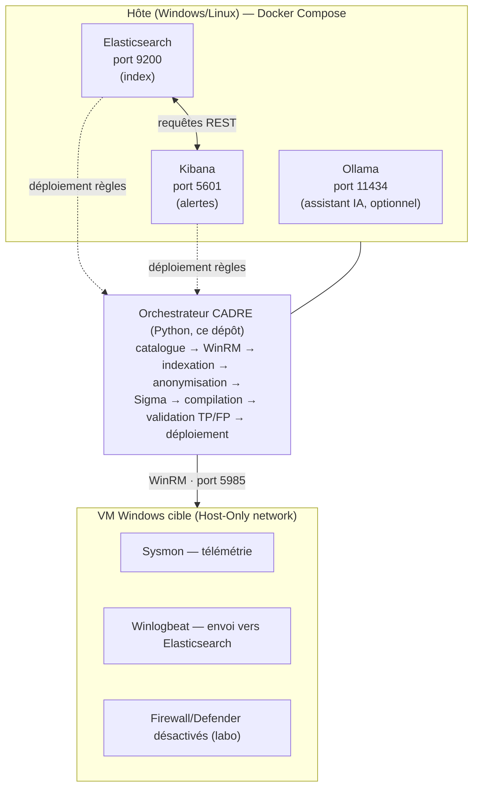

# Guide complet du projet CADRE

> Ce document explique **tout** ce qu'il y a à savoir sur CADRE : le
> problème qu'il résout, les concepts qu'il faut connaître pour le
> comprendre, comment il fonctionne étape par étape, ce que fait chaque
> fichier du code, et comment le faire évoluer. Il est écrit pour que tu
> puisses le lire comme si tu avais construit ce projet toi-même — l'idée
> est de ne rien laisser dans le flou.
>
> **Version documentée : 1.5.0** (dernière mise à jour : 16/08/2026)

---

## Table des matières

1. [Vue d'ensemble en deux minutes](#1-vue-densemble-en-deux-minutes)
2. [Concepts à connaître avant de lire le code](#2-concepts-à-connaître-avant-de-lire-le-code)
3. [Architecture d'ensemble](#3-architecture-densemble)
4. [La méthode de fonctionnement : le cycle d'audit pas à pas](#4-la-méthode-de-fonctionnement--le-cycle-daudit-pas-à-pas)
5. [Tour du code, module par module](#5-tour-du-code-module-par-module)
6. [La CLI en détail](#6-la-cli-en-détail)
7. [Sécurité en profondeur](#7-sécurité-en-profondeur)
8. [Qualité, tests et CI](#8-qualité-tests-et-ci)
9. [L'assistant LLM (Ollama)](#9-lassistant-llm-ollama)
10. [Déploiement réel](#10-déploiement-réel)
11. [Organisation du dossier](#11-organisation-du-dossier)
12. [Chronologie des raffinements déjà faits](#12-chronologie-des-raffinements-déjà-faits)
13. [Raffinements proposés pour la suite](#13-raffinements-proposés-pour-la-suite)
14. [Glossaire](#14-glossaire)
15. [Pour aller plus loin](#15-pour-aller-plus-loin)

---

## 1. Vue d'ensemble en deux minutes

**CADRE** (Continuous Adversary-Driven Rule Engineering) est un outil qui
automatise l'audit d'un SOC (Security Operations Center). Il répond à
trois problèmes concrets :

1. **Les angles morts** : une équipe de détection ne peut jamais écrire de
   règles pour 100% des techniques d'attaque connues. Un attaquant n'a
   qu'à utiliser une technique non couverte pour passer inaperçu.
2. **La dérive temporelle** : une règle écrite il y a un an peut être
   devenue obsolète (changement d'OS, nouvelle technique de contournement,
   changement de configuration).
3. **Le coût humain** : écrire, tester et valider une règle de détection
   prend du temps à un humain — CADRE automatise ce travail.

**Comment il s'y prend, en une phrase** : CADRE exécute (émule) une
technique d'attaque réelle sur une machine cible, vérifie que cette
attaque produit bien une trace exploitable dans le SIEM, génère
automatiquement une règle de détection Sigma pour cette trace, vérifie que
la règle détecte vraiment l'attaque sans être trop bruyante, puis la
déploie dans Kibana.

**Ce qui rend CADRE différent d'un simple script d'attaque (type Atomic
Red Team)** :
- Il ne se contente pas d'attaquer : il **valide** que la détection
  fonctionne (double validation TP/FP, section 4).
- Il **anonymise** systématiquement les données sensibles avant de les
  traiter ou de les envoyer où que ce soit (conformité RGPD).
- Il est **déterministe** : la même attaque produit toujours la même
  règle. Pas de génération aléatoire par IA pour la partie qui compte
  (la règle déployée) — voir section 9 pour comprendre où l'IA intervient
  réellement.

**Chiffres clés au 26/08/2026** :
- **68 attaques** au catalogue, couvrant **12 tactiques MITRE ATT&CK** et
  56 techniques uniques, sous-techniques comprises (44 à risque faible, 21 à
  risque moyen, 3 à risque élevé — chiffres exacts obtenus via `cadre stats`)
- **23 modules Python** dans `src/cadre/`
- **1148 tests** automatisés, **93,99% de couverture de code**
- SIEM cible : **Elastic + Kibana** (le seul actuellement supporté)
- **1 assistant IA optionnel** (Ollama local) — jamais dans le chemin de
  génération/validation/déploiement des règles

---

## 2. Concepts à connaître avant de lire le code

Si un de ces mots ne t'est pas familier, lis cette section avant la
suite — tout le reste du guide part du principe que tu les connais.

### SOC (Security Operations Center)
L'équipe (et l'infrastructure) chargée de surveiller en continu le système
d'information d'une organisation pour détecter des activités malveillantes.
Elle travaille avec un **SIEM** (voir plus bas) qui centralise les
journaux (logs) de tous les systèmes.

### MITRE ATT&CK
Une base de connaissance publique et standardisée qui répertorie les
**tactiques** (les objectifs d'un attaquant : *Execution*, *Persistence*,
*Discovery*...) et les **techniques** (les moyens concrets d'y arriver,
identifiées par un code du type `T1059.001`). C'est le référentiel commun
que toute l'industrie de la cybersécurité utilise pour parler des
attaques de façon non-ambiguë. Chaque attaque du catalogue CADRE est
rattachée à une technique MITRE précise.

### Sysmon / Winlogbeat / Elasticsearch / Kibana (la chaîne de collecte)
- **Sysmon** : un pilote Microsoft installé sur la machine Windows cible.
  Il observe ce qui se passe (création de process, connexions réseau,
  modifications du registre...) et génère des événements détaillés,
  identifiés par un **EventID** (ex : `4688` = création de processus).
- **Winlogbeat** : un agent qui lit ces événements Windows et les envoie
  vers Elasticsearch.
- **Elasticsearch** : la base de données qui indexe tous ces événements et
  permet de les rechercher rapidement.
- **Kibana** : l'interface qui permet de visualiser les données
  d'Elasticsearch et d'y déployer des **règles de détection** (des
  requêtes qui, si elles matchent, déclenchent une alerte).

Ensemble, Sysmon + Winlogbeat + Elasticsearch + Kibana forment un **SIEM**
(Security Information and Event Management) — c'est la pile qu'utilise
CADRE (voir `docker-compose.yml`).

### Sigma
Un format de règle de détection **standardisé et indépendant du SIEM**
(YAML). Une règle Sigma peut être convertie automatiquement vers le
langage natif de nombreux SIEM (Lucene pour Elastic, SPL pour Splunk, KQL
pour Sentinel...). CADRE génère des règles Sigma puis les compile en
requête Lucene via l'outil `sigma-cli`.

### TP / FP (True Positive / False Positive)
- **TP (vrai positif)** : la règle détecte réellement l'attaque qu'elle
  est censée détecter.
- **FP (faux positif)** : la règle se déclenche sur une activité
  parfaitement légitime (bruit). Une règle trop bruyante est inutilisable
  en production — elle noie les vraies alertes.

Une règle de détection "de qualité" doit avoir **au moins 1 TP** (elle
marche) et **peu de FP** (elle n'ennuie pas l'analyste). C'est exactement
ce que vérifie la double validation de CADRE (section 4, étape 7).

### WinRM
Windows Remote Management — le protocole utilisé par CADRE pour exécuter
une commande à distance sur la VM Windows cible, comme le ferait un
administrateur système.

### RGPD / PII
Le RGPD (Règlement Général sur la Protection des Données) impose de
protéger les données personnelles (**PII**, *Personally Identifiable
Information* : adresses IP, emails, noms d'utilisateur...). CADRE anonymise
systématiquement ces données avant traitement ou stockage long terme
(section 7).

---

## 3. Architecture d'ensemble



**Points importants** :
- L'orchestrateur n'est connecté à Internet à aucun moment de son
  exécution : les seules connexions sortantes sont locales (Docker) ou
  vers le réseau Host-Only de la VM (WinRM).
- La VM cible est volontairement affaiblie (firewall et antivirus
  désactivés) — c'est un environnement de laboratoire pour émuler des
  attaques sans qu'elles soient bloquées avant d'avoir généré de la
  télémétrie. **Ne jamais reproduire cette configuration sur une machine
  de production.**
- Ollama est **optionnel** : toute la chaîne du haut (génération,
  validation, déploiement de règles) fonctionne sans lui.

---

## 4. La méthode de fonctionnement : le cycle d'audit pas à pas

C'est le cœur du projet — comprendre ces 8 étapes, c'est comprendre CADRE.
Elles sont implémentées dans `OrchestrateurCADRE.executer_attaque_complete()`
(fichier `src/cadre/orchestrateur.py`), appelée une fois par attaque du
catalogue.

### Étape 1 — Sélection de l'attaque
Une attaque vient du catalogue déterministe (`catalogue_attaques.py`) :
c'est un objet `AttaqueCatalogue` figé (voir section 5.1) qui contient
tout ce qu'il faut savoir sur cette attaque — sa commande, la technique
MITRE associée, les EventIDs Windows qu'elle doit produire, ses faux
positifs connus, etc. Rien n'est inventé à cette étape : c'est une donnée
statique du code.

### Étape 2 — Exécution via WinRM (`executer_commande_winrm`)
1. Vérifie que `pywinrm` est installé et que les identifiants VM sont
   configurés (sinon, échec immédiat et explicite).
2. Teste la connectivité TCP vers le port 5985 de la VM **avant** de
   tenter WinRM (`_verifier_connectivite_vm`) — évite d'attendre un
   timeout WinRM long si la VM est simplement éteinte.
3. Encode la commande en Base64 (UTF-16LE) et l'enveloppe dans un bloc
   PowerShell `Try/Catch` silencieux — ceci contourne un problème réel de
   PowerShell qui échoue à parser certaines commandes contenant `&& < > "`.
4. Exécute avec **3 tentatives** et un backoff exponentiel (2s, 4s) en cas
   d'échec réseau.

### Étape 3 — Attente d'indexation (`attente_indexation.py`)
L'événement généré par l'attaque doit encore transiter par Sysmon →
Winlogbeat → Elasticsearch avant d'être cherchable. CADRE interroge
Elasticsearch en **polling adaptatif** : intervalle court au début (3s),
qui s'allonge progressivement (jusqu'à 15s) pour ne pas surcharger le
cluster, jusqu'à un timeout configurable (180s par défaut). S'il ne trouve
rien à l'expiration du délai, l'attaque est marquée **`ANGLE_MORT`** —
c'est le signal le plus important de CADRE : *l'attaque a bien eu lieu
mais rien n'a été vu*, ce qui pointe vers un problème de collecte
(Sysmon mal configuré, filtre trop agressif...).

### Étape 4 — Anonymisation (`anonymisation.py`)
Avant tout traitement ultérieur, le log brut passe par
`anonymiser_log_elastic()` : IPs, emails, noms d'utilisateur, hashes,
tokens sont remplacés par des marqueurs déterministes
(`[IPV4_ANONYMISE]`, `ANON-xxxxxxxxxxxx`...). Les champs structurellement
sensibles (`user.name`, `host.name`...) sont **toujours** hashés, même
s'ils ne matchent aucun pattern regex — c'est une garantie stricte, pas
une best-effort.

### Étape 5 — Génération de la règle Sigma (`generer_regle_sigma_depuis_attaque`)
**Il n'y a aucun appel LLM ici.** La règle est dérivée mécaniquement à
partir des métadonnées de l'attaque (template Python `.format()`) :
technique MITRE, tags MITRE, niveau de risque, faux positifs connus. Un
UUID v4 est généré pour identifier la règle. **Propriété clé : la même
attaque exécutée deux fois produit toujours la même règle** (à l'UUID et
au timestamp près).

Le `logsource` et le champ de corrélation sont déduits automatiquement du
premier EventID de `event_ids_attendus`, via des tables de correspondance
dans `orchestrateur.py` :

- **EventID Sysmon** (`_SYSMON_EVENT_INFO`) → `logsource.category` Sigma
  (`process_creation`, `registry_event`, `dns_query`, `file_event`,
  `process_access`...) + le champ ECS pertinent pour une corrélation
  textuelle (`process.command_line`, `registry.path`, `dns.question.name`,
  `file.path`...).
- **EventID 4104** (PowerShell Operational, canal séparé de Sysmon) →
  `logsource.service: powershell` + `powershell.file.script_block_text`.
- **EventID natifs Windows** (Security/System — 4720, 4625, 7045...) →
  `logsource.service: security` ou `system`. Un sous-ensemble a un champ
  de corrélation confirmé par inspection de documents réels (ex: 4720 →
  `user.target.name`, **pas** `user.name` qui porte l'auteur de l'action
  et non le compte créé ; 7045 → `service.name`) ; les autres restent sur
  `event.code` seul, déjà suffisamment spécifique pour ces EventID rares.

Si l'attaque définit `valeur_detection` (un texte **déjà présent dans sa
commande réelle** — jamais un marqueur injecté séparément) et que l'EventID
principal a un champ de corrélation connu, la sélection ajoute
`{champ}|contains: '{valeur_detection}'` en plus de `event.code`. Sans
`valeur_detection`, la règle se limite à `event.code` (c'est délibéré pour
les EventID déjà rares comme 4698 ou 4625 ; ça aurait été trop large pour
l'EventID 1, beaucoup trop fréquent, qui a donc toujours une valeur définie
dans le catalogue).

> **Historique** : les versions < 1.5.0 codaient en dur
> `process.command_line|contains: 'CADRE_TEST_<id>'`, un marqueur qui
> n'était en réalité **jamais injecté** dans la commande exécutée (bug).
> Toute attaque dont le signal réel n'était pas dans `process.command_line`
> (création de compte, service, registre, DNS...) échouait donc
> systématiquement la double validation en usage réel (non-simulé) — ce qui
> n'avait jamais été détecté car les cycles de test tournaient tous en
> `--simulate`, qui saute cette étape. Voir `CHANGELOG.md` v1.5.0.

### Étape 6 — Compilation Sigma → Lucene (`compilation_sigma.py`)
La règle YAML est passée à l'outil externe `sigma-cli`
(`sigma convert -t lucene -p ecs_windows`) qui produit une requête Lucene
exploitable par Elasticsearch. Si l'outil n'est pas installé ou échoue,
la fonction retourne `None` proprement (pas de crash) et l'attaque est
marquée `ERREUR`.

### Étape 7 — Double validation TP/FP (`double_validation_tp_fp`)
C'est ce qui distingue CADRE d'un simple générateur de règles :
1. **Validation syntaxique** de la requête Lucene (guillemets et
   parenthèses équilibrés).
2. **Test TP** : la requête doit matcher **au moins 1 événement** sur les
   10 dernières minutes (`FENETRE_TP_SEC = 600`). Zéro résultat →
   `FAUX_NEGATIF`, la règle est rejetée.
3. **Test FP** : la requête est aussi exécutée sur les **7 derniers
   jours** (`FENETRE_FP_SEC = 604800`), en excluant la fenêtre TP. Si elle
   remonte plus de **50 événements** (`SEUIL_FP_MAX`), elle est jugée trop
   bruyante et rejetée (`TROP_DE_FP`).

Seule une règle qui passe les deux tests est éligible au déploiement.

### Étape 8 — Déploiement dans Kibana (`deployer_kibana`)
Appel à l'API REST Kibana (`/api/detection_engine/rules`) pour créer la
règle : nom, description, score de risque (dérivé du niveau de risque de
l'attaque), intervalle d'exécution (5 min), fenêtre de lookback (10 min).
Le résultat final de l'attaque est :
- **`VALIDE`** — générée, validée, déployée avec succès
- **`VALIDE_NON_DEPLOYE`** — validée mais Kibana a refusé le déploiement
  (ex : API indisponible)
- **`REJETE`** — a échoué la double validation
- **`ANGLE_MORT`** — aucune télémétrie trouvée à l'étape 3
- **`ERREUR`** — échec technique à n'importe quelle étape

### Étape 9 — Rapport
`OrchestrateurCADRE._generer_rapports_fin_cycle()` regroupe les résultats
de toutes les attaques du cycle en un rapport Markdown + un export CSV
(`rapport.py`), écrits dans `rapports/`.

### Le mode simulation
`_executer_attaque_simulation()` (déclenché par `--simulate`) exécute les
étapes 4 à 6 (génération + compilation Sigma) mais **saute** les étapes 2
et 3 (pas de VM, pas d'attente réelle) et remplace l'étape 7 par un statut
fixe `SIMULE` avec TP=FP=0. C'est le mode utilisé pour développer, faire
des démonstrations, ou dans une CI qui n'a pas accès à une VM Windows.

### Le cycle complet, la boucle, et la rotation
- `executer_cycle_complet()` répète les étapes ci-dessus pour toutes les
  attaques du catalogue (ou un sous-ensemble filtré par technique).
- `BoucleAutomatisee` (`boucle.py`) répète des **cycles** dans le temps,
  avec un **intervalle configurable** et une **rotation** : à chaque
  cycle, un sous-ensemble différent d'attaques est choisi
  (`_selectionner_techniques_rotation`, décalage circulaire dans le
  catalogue), pour éviter de tester toujours les mêmes techniques et
  étaler la charge. Elle notifie les résultats par webhook (Slack/Discord)
  et/ou email, et accumule des statistiques dans
  `rapports/cadre_cumulatif.json`.

---

## 5. Tour du code, module par module

Tous les fichiers sont dans `src/cadre/`.

### 5.1 `catalogue_attaques.py` — la source de vérité
Définit `AttaqueCatalogue`, une **dataclass Python figée**
(`@dataclass(frozen=True)`) : une fois créée, une instance ne peut plus
être modifiée (toute tentative lève `FrozenInstanceError`). C'est un choix
de conception délibéré : le catalogue ne doit **jamais** pouvoir être
altéré à l'exécution, ce qui garantit le déterminisme de tout le
pipeline. `CATALOGUE` est une simple liste Python de 68 instances (compte à
jour via `cadre stats` ou `len(CATALOGUE)`), codée en dur dans ce fichier
(pas de base de données, pas de fichier de config externe — ajouter une
attaque, c'est ajouter une entrée dans cette liste, via une pull request
revue comme le reste du code).

Fonctions utilitaires : `obtenir_attaque(id)`, `obtenir_par_technique(...)`,
`obtenir_par_tactique(...)`, `statistiques_catalogue()`,
`lister_attaques()` / `lister_attaques_dict()`.

Champ `valeur_detection` (depuis v1.5.0, optionnel, `None` par défaut) :
un texte **déjà présent dans `commande`** (jamais une valeur injectée à
part) utilisé par `generer_regle_sigma_depuis_attaque()` pour corréler
précisément l'événement — voir étape 5 en section 4. `champ_principal`
reste un champ purement documentaire (non exploité par la génération de
règle), utile pour qu'un humain comprenne d'un coup d'œil le signal visé.

> **Limite connue (hors scope v1.5.0)** : `compiler_sigma_vers_lucene()`
> compile toujours avec le pipeline `-p ecs_windows`, quel que soit
> `attaque.plateforme`. Les 4 attaques `CADRE-LIN-00x` ont un
> `valeur_detection` renseigné par cohérence, mais leur validation TP/FP
> réelle n'est pas garantie sans un pipeline `ecs_linux`/`auditd` dédié —
> à traiter dans un futur incrément.

### 5.2 `orchestrateur.py` — le chef d'orchestre
Contient la classe `OrchestrateurCADRE`, décrite en détail section 4.
C'est le fichier le plus gros du projet (~240 lignes de logique). Il ne
fait *pas* le travail lui-même : il délègue à `attente_indexation.py`,
`anonymisation.py`, `compilation_sigma.py` et `rapport.py`, et se
contente d'orchestrer l'ordre des opérations et la gestion des erreurs.

### 5.3 `attente_indexation.py` — le polling adaptatif
Deux fonctions : `attendre_indexation()` (boucle de polling décrite en
étape 3) et `compter_evenements()` (requête `_count` Elasticsearch,
réutilisée par la double validation TP/FP).

### 5.4 `anonymisation.py` — la conformité RGPD
`PATTERNS_PII` : un dictionnaire de regex compilées (IPv4, IPv6, email,
username, domaine, hash MD5/SHA1/SHA256, NTLM, mot de passe, token
Bearer...). `CHAMPS_SENSIBLES` : une liste de noms de champs ECS
(Elastic Common Schema) toujours traités comme sensibles quel que soit
leur contenu (`user.name`, `host.name`, `source.ip`...).
`anonymiser_chaine()` traite du texte libre, `anonymiser_dict()` descend
récursivement dans un document JSON (avec une limite de profondeur de
sécurité), `anonymiser_log_elastic()` est le point d'entrée utilisé par
l'orchestrateur, qui préserve volontairement les champs non-sensibles
utiles à la corrélation (`@timestamp`, `event.code`...).

### 5.5 `compilation_sigma.py` — Sigma → Lucene + double validation
`compiler_sigma_vers_lucene()` (appelle le binaire externe `sigma`),
`valider_syntaxe_lucene()` (vérifications basiques hors-ligne),
`double_validation_tp_fp()` (décrite en étape 7).

### 5.6 `coffre_fort.py` — la gestion des secrets
`CoffreFortCADRE` lit un secret dans cet ordre de priorité :
**variable d'environnement → trousseau système (Windows Credential
Manager / macOS Keychain / Linux Secret Service via `keyring`) → fichier
`.env` local**. À l'écriture, l'ordre est inversé (trousseau système
préféré, fichier `.env` en repli, avec permissions restreintes `0o600`).
Aucun secret n'est jamais écrit dans le code ou loggé en clair. Un
singleton (`obtenir_coffre()`) garantit qu'une seule instance vit par
process.

### 5.7 `logger.py` — traçabilité forensic
`CADRELogger` écrit sur deux sorties simultanément : une sortie console
lisible avec couleurs ANSI, et un fichier **JSON structuré** (une ligne
par événement) dans `logs/cadre.log.json`, essentiel pour l'audit
a posteriori. Types d'événements : `ATTACK_EXEC`, `RULE_GEN`,
`VALIDATION_TP`, `RULE_REJECTED`, `BLIND_SPOT`, etc.

### 5.8 `rapport.py` — la restitution
`generer_rapport_cycle()` (Markdown détaillé par cycle, avec la synthèse
IA optionnelle — section 9), `generer_csv()` (export tabulaire),
`generer_rapport_soutenance()` (rapport académique complet, pensé pour
une soutenance de projet).

### 5.9 `boucle.py` — l'automatisation continue
`BoucleAutomatisee`, décrite en fin de section 4. Gère aussi l'arrêt
propre sur `Ctrl+C` via un gestionnaire de signal (`_handler_sigint`) qui
positionne un indicateur vérifié entre chaque attaque et entre chaque
cycle — l'arrêt intervient toujours *après* l'attaque en cours, jamais en
la coupant brutalement.

### 5.10 `assistant_llm.py` — la couche IA optionnelle
Voir section 9, entièrement dédiée.

### 5.11 `cli.py` — l'interface utilisateur
Construit avec **Click** (bibliothèque de CLI Python à base de
décorateurs) pour le parsing des commandes/options, et **rich** pour
tout l'affichage (bannière, tableaux, panneaux, JSON coloré) — les deux
se complètent sans se marcher dessus : Click gère `cadre list --help`,
rich gère ce qui s'affiche une fois la commande exécutée. La couleur se
désactive automatiquement hors terminal (tests, redirection), rich s'en
charge seul. Voir section 6.

### 5.12 `__init__.py`
Expose `__version__`, `__author__`, `__license__` — utilisé par
`pyproject.toml` (via `cadre.cli:main` comme point d'entrée du script
`cadre`) et par la CLI elle-même (`cadre --version`).

---

## 6. La CLI en détail

Toutes les commandes commencent par `cadre` (ou `python -m cadre.cli` si
le package n'est pas installé en mode script).

| Commande | Ce qu'elle fait |
|----------|------------------|
| `cadre init` | Configure les secrets de façon interactive (VM, Elastic, Kibana) |
| `cadre init --set CLE=VALEUR` | Définit un secret sans interaction (scripts, CI) |
| `cadre init --list` | Liste les **noms** des secrets configurés (jamais leurs valeurs) |
| `cadre cycle` | Exécute un cycle complet sur tout le catalogue |
| `cadre cycle --technique T1059.001` | Limite le cycle à une ou plusieurs techniques |
| `cadre cycle --id CADRE-PER-001` | Exécute une ou plusieurs attaques précises (répétable) |
| `cadre cycle --simulate` | Mode simulation, sans VM (voir section 4) |
| `cadre cycle --llm` | Ajoute une synthèse IA au rapport (section 9) |
| `cadre status` | Vérifie que Elasticsearch et Kibana répondent |
| `cadre list` | Liste les 68 attaques du catalogue |
| `cadre stats` | Statistiques du catalogue (tableaux colorés ; `--json` pour la sortie brute scriptable) |
| `cadre rapport --soutenance` | Génère le rapport de soutenance complet |
| `cadre loop` | Boucle automatisée avec rotation (voir section 4) |
| `cadre loop --webhook <url> --email <adresse>` | Ajoute des notifications |
| `cadre daemon` | Mode arrière-plan avec fichier PID (Linux uniquement pour le fork réel) |
| `cadre metrics` | Expose des métriques Prometheus sur `/metrics` (port 9090 par défaut) |
| `cadre metriques` | Affiche la valeur métier du dernier cycle (temps gagné, couverture) — à ne pas confondre avec `cadre metrics` ci-dessus (export Prometheus HTTP) |
| `cadre suggest -d "description"` | Brouillon d'attaque assisté par IA (section 9) |
| `cadre decouvrir -d "description"` | Agent IA autonome : génère ET exécute une attaque dans le labo isolé, n'ajoute au catalogue perso que si validée TP/FP (section 9) |
| `cadre dashboard` | Dashboard web local (cycles, rapports, catalogue, Découverte IA, revue, outils — voir section 10) |
| `cadre atomic` | Ingère Atomic Red Team comme source d'attaques (filtrée par le garde-fou anti-destruction, puis validée TP/FP) |
| `cadre scenario` | Émule une kill chain d'adversaire complète (plusieurs attaques enchaînées) et mesure sa couverture |
| `cadre derive` | Détecte si une règle déjà validée se dégrade dans le temps (perte de détection ou dérive de bruit) |
| `cadre raffiner` | Affine les paramètres de détection d'une attaque déjà au catalogue (jamais une nouvelle entrée) |
| `cadre rechercher <mot-clé>` | Cherche une attaque par mot-clé dans le catalogue natif et Atomic Red Team |
| `cadre valider-regle` | Valide une règle Sigma existante (TP/FP) sans repasser par un cycle complet |
| `cadre export-sigma` | Exporte les règles du catalogue au format Sigma partageable (contribution) |
| `cadre regle lire <id>` | Affiche l'état actuel d'une règle déjà déployée dans Kibana |
| `cadre regle editer <id>` | Prépare un fichier Sigma éditable pour une règle déjà déployée |
| `cadre regle pousser <id>` | Revalide et repousse une règle Kibana éditée |
| `cadre revue lister` | Liste les règles validées TP/FP mais pas encore déployées (en attente de revue humaine) |
| `cadre revue approuver <id>` | Revalide et déploie une règle en attente (potentiellement éditée) |
| `cadre revue rejeter <id>` | Rejette une règle en attente — rien n'est déployé, l'entrée est retirée |
| `cadre nettoyer-kibana` | Inventorie les règles CADRE orphelines dans Kibana (`rule_id` non `cadre-…`, résidu d'anciens déploiements) et, avec `--appliquer`, les supprime — jamais une détection unique sans règle à jour couvrant la même technique |

**Exemple concret d'audit ciblé, sans risque** :
```bash
cadre cycle --id CADRE-DIS-001 --simulate
```
Ceci génère et compile une vraie règle Sigma pour une attaque de
découverte, sans toucher à la moindre VM — la meilleure façon de tester
que ta configuration fonctionne avant un vrai cycle.

---

## 7. Sécurité en profondeur

### Le modèle de menace résumé
Le document complet est `docs/THREAT_MODEL.md` (analyse STRIDE). Les
points essentiels :
- L'orchestrateur n'a jamais accès Internet en exécution.
- WinRM doit être configuré en HTTPS (port 5986) en production — le port
  5985 (HTTP) est acceptable uniquement sur un réseau Host-Only isolé de
  labo.
- Le LLM local (Ollama) est identifié comme un vecteur de risque
  théorique (exfiltration si le modèle était compromis) — probabilité
  jugée très faible car 100% local et sans accès réseau externe.

### Règles absolues (non négociables)
1. Aucun secret en clair dans le code source (vérifié par un hook
   pre-commit, voir `.pre-commit-config.yaml`).
2. Aucun secret loggé en clair.
3. Anonymisation systématique avant tout rapport ou envoi à l'assistant
   IA.
4. Les tests ne doivent jamais dépendre de vrais secrets (fixture
   `isolation_environnement` dans `tests/conftest.py`, qui redirige
   `HOME`/`USERPROFILE` vers un répertoire temporaire pour chaque test).

### Ce qui reste à durcir avant un déploiement client réel
Voir `docs/SECURITY.md` : rotation des secrets, WinRM HTTPS obligatoire,
authentification renforcée sur l'API Kibana, séparation des
environnements de test et de production.

---

## 8. Qualité, tests et CI

### Lancer les tests
```bash
pytest tests/ -v                                    # tous les tests
pytest tests/ -q --cov=cadre --cov-report=term-missing  # avec couverture
pytest tests/test_orchestrateur.py -v                # un seul module
ruff check src/ tests/                               # lint
black --check src/ tests/                            # formatage
mypy src/cadre                                       # typage statique
bandit -r src/                                       # scan sécurité
```

### Comment les tests sont organisés
Chaque module de `src/cadre/` a son fichier `tests/test_<module>.py`
miroir. Principe systématique : **aucun test ne doit toucher un vrai
réseau, une vraie VM, ou le vrai trousseau système de la machine** — tout
est simulé avec des doublures de test (`monkeypatch` de `requests.post`,
classes factices type `ReponseFactice`/`SocketFactice`). C'est ce qui
permet à la suite de tourner en ~25 secondes sans aucune dépendance
externe.

Le seuil de couverture minimum est fixé à **75%** dans `pyproject.toml`
(`[tool.coverage.report] fail_under = 75`) — la CI échoue si on passe
en dessous. Couverture actuelle : **~93%** (voir le chiffre exact en tête
du README, mis à jour à chaque mesure).

### CI/CD
`.github/workflows/cadre-ci.yml` (un seul job `qualite`, sur `push`/`pull_request`
vers `main`) : hygiène du dépôt (hooks pre-commit-hooks non couverts en local
via `--no-verify` : gros fichier, marqueur de conflit, clé privée), tests +
couverture (pytest, seuil 75%), lint (ruff), formatage (black), typage
(mypy), sécurité statique (bandit), audit des dépendances (pip-audit, non
bloquant — voir `docs/SECURITY.md`), secrets (detect-secrets). Un seul OS
(`ubuntu-latest`) et une seule version de Python (3.13) — pas de matrice
multi-OS/multi-version, pas d'étape de build/publication sur tag, pas
d'audit programmé (`schedule`) : à envisager si le projet grandit, mais pas
en place aujourd'hui. `safety` n'est plus utilisé (remplacé par `pip-audit`,
gratuit et sans compte requis).

---

## 9. L'assistant LLM (Ollama)

### La règle d'or
**L'assistant IA ne fait jamais partie du chemin de génération, de
validation ou de déploiement d'une règle.** Ces trois opérations restent
100% déterministes (sections 4 et 5.1/5.2/5.5). L'assistant est une
couche d'assistance *autour* du pipeline, jamais *dans* le pipeline.
Pourquoi ce choix : un LLM peut halluciner ou produire des résultats
variables d'une exécution à l'autre — inacceptable pour une règle de
détection qui doit être auditable et reproductible. C'est aussi ce qui
différencie commercialement CADRE d'outils qui génèrent des règles par
IA sans garantie de reproductibilité.

### Ce que fait concrètement `assistant_llm.py`
Client HTTP minimal vers l'API REST d'Ollama (`/api/generate`), sans
dépendance supplémentaire (`requests` est déjà utilisé partout ailleurs).
Trois capacités :

1. **`suggerer_attaque(description, technique_mitre=None)`** — via
   `cadre suggest`. Tu décris une attaque en langage naturel, le modèle
   répond avec un objet JSON structuré (nom, technique, commande,
   EventIDs...) marqué `"brouillon_ia": true`. **Ce brouillon n'est
   jamais inséré automatiquement dans le catalogue** — tu dois le relire
   et l'ajouter toi-même dans `catalogue_attaques.py` (voir
   `CONTRIBUTING.md`), exactement comme n'importe quelle autre
   contribution.
2. **`resumer_cycle(resultats)`** — via `cadre cycle --llm`. Génère un
   paragraphe de synthèse exécutive pour un rapport, avec instruction
   explicite dans le prompt de ne jamais inventer de statistique absente
   des données réelles fournies.
3. **`analyser_angles_morts(resultats)`** — pistes d'investigation pour
   les techniques marquées `ANGLE_MORT` (config Sysmon probable en cause).

### Dégradation gracieuse
Si Ollama n'est pas démarré ou ne répond pas, chaque méthode retourne
`None` et logue un avertissement — **le reste de CADRE continue de
fonctionner normalement**. C'est vérifié par des tests dédiés
(`tests/test_assistant_llm.py`, `tests/test_cli.py`).

### Configuration
Variables d'environnement (voir `.env.example`) :
```
CADRE_OLLAMA_URL=http://127.0.0.1:11434
CADRE_OLLAMA_MODEL=llama3.1:8b
CADRE_OLLAMA_TIMEOUT_SEC=180
```
Le timeout à 180s n'est pas arbitraire : en conditions réelles, une
génération JSON structurée peut prendre 1 à 2 minutes sur du matériel
modeste (ce n'était pas le cas au départ — le timeout initial de 60s a
été corrigé après un test réel qui a échoué en timeout à 108 secondes).

### Utilisation pratique
```bash
docker compose up -d ollama
docker exec -it cadre-ollama ollama pull llama3.1:8b
cadre suggest -d "Dump de la base SAM via reg.exe save" -t T1003.002
```

---

## 10. Déploiement réel

### En local (développement / démo)
```bash
git clone https://github.com/Mohamed-Amine-Eddari/cadre.git
cd cadre
pip install -r requirements.txt && pip install -e .
docker compose up -d          # Elasticsearch + Kibana + Ollama
cadre init                    # configure les secrets
cadre status                  # vérifie la stack
cadre cycle --id CADRE-DIS-001 --simulate   # premier test sans risque
```

### Prérequis pour un cycle réel (non simulé)
- Une VM Windows 10 (VirtualBox recommandé) avec Sysmon et Winlogbeat
  installés et configurés pour envoyer vers ton Elasticsearch.
- WinRM activé sur la VM (`Enable-PSRemoting -Force`) et joignable sur le
  réseau Host-Only.
- Les secrets configurés via `cadre init` (jamais dans `.env` en clair
  pour un mot de passe — `.env` ne doit contenir que des valeurs non
  sensibles comme les URLs, voir `.env.example`).

**Piège fréquent avec WinRM sur une VM Host-Only** : `winrm quickconfig -force`
peut échouer avec *"le type de connexion réseau de cet ordinateur est défini
à Public"*. Windows classe parfois l'adaptateur Host-Only comme réseau
"Public", et le pare-feu bloque WinRM sur ce profil par défaut. Correction,
**dans la VM** :
```powershell
Get-NetConnectionProfile | Set-NetConnectionProfile -NetworkCategory Private
winrm quickconfig -force
```

### Démarrage automatique de tout l'environnement
`scripts/demarrer-environnement.ps1` remplace la routine manuelle (Docker
Desktop, SIEM, VM, vérifications) par une seule commande : il démarre
Docker Desktop si besoin, lance le SIEM (`docker compose up -d` dans
`CADRE_SIEM/`), démarre la VM cible si elle est éteinte, attend que WinRM
réponde, vérifie Ollama, puis lance `cadre status`. Chaque étape attend
que la précédente **réponde vraiment**, pas juste qu'elle soit lancée.
```powershell
cd <votre-répertoire>\CADRE
.\scripts\demarrer-environnement.ps1
```
Les chemins (VM, VirtualBox, Docker Desktop) sont en constantes en haut du
script — à adapter si ton installation diffère.

### Vérification complète en une commande
`scripts/verifier-tout.ps1` enchaîne qualité du code (tests + couverture,
ruff, black, mypy), démarrage/état de l'environnement (via le script
ci-dessus), puis un cycle d'audit réel sur tout le catalogue :
```powershell
.\scripts\verifier-tout.ps1
```
Ajoute `-RapideSansCycle` pour s'arrêter après la qualité du code et
l'environnement, sans lancer le cycle complet (~10-20 min contre la VM et
le SIEM réels).

### Sur un vrai SIEM en production
Voir `docs/INSTALL.md` (installation pas à pas) et `docs/SECURITY.md`
avant tout déploiement hors laboratoire — en particulier le passage en
WinRM HTTPS et la rotation des secrets.

---

## 11. Organisation du dossier

Le dossier a été réorganisé pour ne garder à la racine que ce qui est
standard pour un projet open-source :

```
CADRE/
├── README.md, LICENSE, CHANGELOG.md            # présentation, licence, historique
├── CONTRIBUTING.md, CODE_OF_CONDUCT.md          # règles de contribution
├── pyproject.toml, requirements*.txt            # dépendances Python
├── Dockerfile, docker-compose.yml, Makefile     # infra
├── .env.example, .gitignore, .pre-commit-config.yaml
├── .github/                                     # CI + templates d'issues
├── src/cadre/                                   # le code (23 modules, section 5)
├── tests/                                       # 1168 tests (section 8)
├── docs/
│   ├── GUIDE_PROJET.md                          # CE FICHIER
│   ├── ARCHITECTURE.md, INSTALL.md, SECURITY.md,
│   │   THREAT_MODEL.md, WHITE_PAPER.md          # documentation produit
│   └── api/                                     # doc API (Sphinx)
├── site/                                        # page web de présentation
├── rapports/                                    # sorties générées par `cadre cycle` (vide au repos, gitignored)
├── rules_generees/                              # règles Sigma générées, conservées comme exemples
└── logs/                                        # logs JSON (gitignored, jamais commité)
```

**Ce qui a changé lors du dernier rangement** :
- Les artefacts de build/cache (`build/`, `.mypy_cache/`, `.pytest_cache/`,
  `.ruff_cache/`, `.coverage`) ont été supprimés — ils sont entièrement
  régénérés à la prochaine exécution des outils correspondants, aucune
  perte d'information.
- `logs/cadre.log.json` et le contenu de `rapports/` ont été vidés — ce
  sont des sorties générées (le `.gitignore` les traite d'ailleurs comme
  potentiellement sensibles, PII inclus), rien d'important n'y était
  archivé volontairement.
- Les documents issus des sessions de développement assisté ne sont pas
  publiés dans ce dépôt (notes de travail internes) ; ce guide-ci en est
  la référence à jour.

---

## 12. Chronologie des raffinements déjà faits

| Version | Ce qui a changé |
|---------|------------------|
| 0.5.0 | POC initial, 3 attaques, connexion Elastic basique |
| 0.9.0 | Bêta : 8 attaques, WinRM basique, pas encore de validation TP/FP |
| 1.0.0 | Première release stable : 12 attaques, coffre-fort, anonymisation RGPD, double validation TP/FP, rapports, CLI, CI/CD |
| 1.1.0 | Catalogue étendu à 26 attaques (+ Linux), mode simulation, boucle automatisée (`cadre loop`/`daemon`/`metrics`), corrections de bugs (UUID Sigma, template, encodage Windows) |
| — (nettoyage qualité) | Couverture de tests 46% → 87%, 0 erreur ruff/mypy, correction d'un vrai bug (`coffre_fort.supprimer()` qui ne supprimait pas du fichier `.env`), remplacement des informations d'auteur |
| 1.2.0 | Assistant LLM (Ollama) réellement intégré en couche d'assistance (`cadre suggest`, `cadre cycle --llm`) ; correction d'une incohérence documentaire (le rapport de soutenance affirmait à tort que le LLM générait les règles Sigma) |
| — (rangement) | Rangement du dossier, guide de référence complet, correction des chiffres de catalogue restés à "12 attaques / 7 tactiques" dans `README.md`, `docs/WHITE_PAPER.md` et le rapport de soutenance |
| 1.3.0 | Catalogue étendu à 34 attaques / 11 tactiques : ajout de *Privilege Escalation* et *Collection* (tactiques jusque-là absentes), renforcement de Lateral Movement, Command and Control et Credential Access |
| 1.4.0 | Interface CLI habillée avec `rich` (déjà une dépendance déclarée mais jamais utilisée) : bannière, tableaux colorés (`list`, `stats`, `status`), synthèse de cycle en panneau, JSON coloré pour `cadre suggest` ; détection de support couleur unifiée entre `logger.py` et la CLI |
| 1.5.0 | Correctif complet du moteur de détection : le premier cycle réel (non-simulé) avait révélé que la règle Sigma générée ne matchait jamais rien (`process.command_line` codé en dur, marqueur jamais injecté). Génération de règle reconstruite pour déduire `logsource` et le champ de corrélation depuis l'EventID réel (`process_creation`, `registry_event`, `dns_query`, service `security`/`system`/`powershell`...) ; nouveau champ `valeur_detection` sur le catalogue (texte déjà présent dans chaque commande réelle). Une validation en réel sur les 34 attaques a ensuite fait remonter des bugs d'exécution indépendants, tous corrigés : chaînage `&&`/`&` invalide en PowerShell 5.1 (~18 commandes), `2>nul` invalide sous WinRM (9 commandes, remplacé par `2>$null`), alias PowerShell `sc`→`Set-Content` masquant `sc.exe`, casse de `WMIC.exe`, `2>&1` natif cassant la session WinRM, `Compress-Archive` sur dossier vide, retry anti-latence dans la double validation. Compilation Sigma migrée de `sigma-cli` (sous-processus) vers l'API Python `pysigma` en mémoire (~150x plus rapide). Rapport de cycle restructuré en sections par statut. Nouveau script `verifier-tout.ps1` regroupant qualité de code + environnement + cycle réel en une commande. |

---

## 13. Raffinements proposés pour la suite

Classés par effort croissant. Aucun n'a été implémenté ici : ce sont des
pistes, à choisir et scoper avec toi avant de s'y lancer (comme on l'a
fait pour l'assistant LLM).

**Rapide (quelques heures)**
- ~~Nettoyer les mentions de "12 attaques" obsolètes~~ — fait pendant ce
  même rangement (`rapport.py`, `README.md`, `docs/WHITE_PAPER.md`).
- ~~Retirer `cadre init-keys` du docstring de `cli.py`~~ (commande jamais
  implémentée — `cadre init` gère déjà le coffre-fort) — fait.
- Ajouter un `Makefile`/script `make guide` qui régénère automatiquement
  les chiffres du catalogue cités dans ce guide (actuellement recopiés à
  la main — risque de dérive si le catalogue change à nouveau).

**Moyen (quelques jours)**
- Un deuxième backend SIEM (Wazuh est le plus cohérent avec le
  positionnement open-source actuel ; Splunk pour la traction
  commerciale) : ajouter `compilation_<siem>.py` sur le modèle de
  `compilation_sigma.py`, comme documenté dans `CONTRIBUTING.md`.
- Un mode `cadre suggest --ajouter` qui, après confirmation explicite de
  l'utilisateur (prompt interactif), écrit directement l'entrée validée
  dans `catalogue_attaques.py` — tout en gardant l'insertion manuelle
  comme option par défaut.
- ~~Étendre le catalogue au-delà des tactiques peu couvertes~~ — fait en
  v1.3.0 (Privilege Escalation et Collection ajoutées, Lateral Movement/
  Command and Control/Credential Access renforcées). Reste à renforcer :
  **Impact** (toujours 1 seule attaque) et **Defense Evasion sur Linux**
  (0 attaque Linux dans cette tactique actuellement).

**Plus structurant**
- Durcissement production : WinRM HTTPS par défaut, rotation automatique
  des secrets, RBAC sur l'API CADRE si une interface web est ajoutée.
- Interface web (mentionnée comme perspective dans le rapport de
  soutenance) pour piloter les cycles sans CLI — utile pour une
  démonstration commerciale.
- Publier `rules_generees/` comme bibliothèque de règles Sigma
  réutilisable indépendamment de CADRE (à la manière de SigmaHQ).

---

## 14. Glossaire

| Terme | Définition |
|-------|-----------|
| **AGPL-3.0** | Licence open-source de CADRE : copyleft fort, toute modification déployée en réseau doit être republiée |
| **Angle mort** | Statut `ANGLE_MORT` : l'attaque a eu lieu mais aucune télémétrie n'a été trouvée |
| **CI/CD** | Intégration/déploiement continu — automatisation des tests et publications (`.github/workflows/`) |
| **Dataclass frozen** | Classe Python dont les instances sont immuables après création |
| **ECS** | Elastic Common Schema — convention de nommage des champs (`user.name`, `host.name`...) |
| **EventID** | Identifiant numérique d'un type d'événement Windows (ex: `4688` = création de process) |
| **FP** | Faux positif — la règle se déclenche sur une activité légitime |
| **Lucene** | Langage de requête utilisé par Elasticsearch |
| **MITRE ATT&CK** | Référentiel public des tactiques/techniques d'attaque |
| **Ollama** | Serveur permettant de faire tourner un LLM en local, sans cloud |
| **PII** | Personally Identifiable Information — données personnelles à protéger |
| **RGPD** | Règlement Général sur la Protection des Données (UE) |
| **Sigma** | Format YAML standardisé de règle de détection, indépendant du SIEM |
| **SIEM** | Security Information and Event Management — plateforme de centralisation/analyse de logs |
| **SOC** | Security Operations Center — équipe de surveillance sécurité |
| **Sysmon** | Pilote Windows qui génère une télémétrie détaillée pour la sécurité |
| **Tactique MITRE** | La catégorie d'objectif d'un attaquant (ex: *Persistence*) |
| **Technique MITRE** | Le moyen concret utilisé (ex: `T1059.001` = PowerShell) |
| **TP** | Vrai positif — la règle détecte réellement l'attaque visée |
| **WinRM** | Windows Remote Management — protocole d'exécution de commandes à distance |
| **Winlogbeat** | Agent qui envoie les logs Windows vers Elasticsearch |

---

## 15. Pour aller plus loin

- Documentation produit : `docs/ARCHITECTURE.md`, `docs/INSTALL.md`,
  `docs/SECURITY.md`, `docs/THREAT_MODEL.md`, `docs/WHITE_PAPER.md`
- Contribuer : `CONTRIBUTING.md` (comment ajouter une attaque, un
  backend SIEM, ouvrir une PR)
- MITRE ATT&CK officiel : https://attack.mitre.org
- Spécification Sigma : https://github.com/SigmaHQ/sigma
- Documentation Ollama : https://github.com/ollama/ollama

**Si tu veux vraiment tout comprendre au niveau du code**, l'ordre de
lecture recommandé est : `catalogue_attaques.py` (les données) →
`orchestrateur.py` (le flux, en gardant la section 4 de ce guide ouverte
en parallèle) → `compilation_sigma.py` et `anonymisation.py` (les deux
briques les plus denses) → `cli.py` (comment tout ça s'assemble en
commandes) → les tests correspondants, qui documentent le comportement
attendu par l'exemple mieux que n'importe quel texte.
