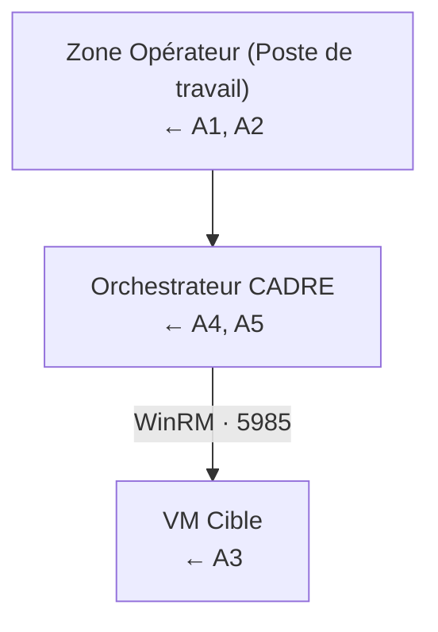
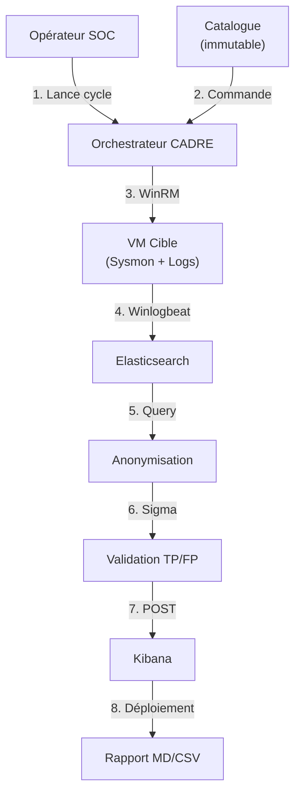

# Modèle de menace CADRE

> Analyse formelle des menaces (méthodologie STRIDE) et contre-mesures associées.
> Ce document accompagne [`SECURITY.md`](SECURITY.md) qui décrit les bonnes
> pratiques opérationnelles.

## 1. Méthodologie

CADRE est analysé selon la méthode **STRIDE** :

| Catégorie | Question |
|-----------|----------|
| **S**poofing | Quelqu'un peut-il se faire passer pour un acteur légitime ? |
| **T**ampering | Quelqu'un peut-il modifier des données en transit ou au repos ? |
| **R**epudiation | Quelqu'un peut-il nier une action qu'il a commise ? |
| **I**nformation Disclosure | Quelqu'un peut-il lire des données sensibles ? |
| **D**enial of Service | Quelqu'un peut-il empêcher le système de fonctionner ? |
| **E**levation of Privilege | Quelqu'un peut-il obtenir plus de droits qu'il ne devrait ? |

---

## 2. Périmètre

### Actifs à protéger

| ID | Actif | Criticité |
|----|-------|-----------|
| A1 | Identifiants Windows (WinRM) | Critique |
| A2 | Identifiants Elasticsearch / Kibana | Critique |
| A3 | Logs de la cible (peuvent contenir des PII) | Haute |
| A4 | Catalogue d'attaques (secret défense) | Moyenne |
| A5 | Règles Sigma générées (propriété intellectuelle) | Moyenne |
| A6 | Rapports Markdown/CSV | Faible-Moyenne |
| A7 | Disponibilité de l'orchestrateur | Moyenne |
| A8 | Intégrité du pipeline (non-détournement) | Critique |

### Acteurs

| Acteur | Description | Confiance |
|--------|-------------|-----------|
| Opérateur SOC | Lance les audits, consomme les rapports | Élevée (authentifié) |
| Ingénieur détection | Examine les règles générées | Élevée |
| Auditeur externe | Accès lecture seule aux rapports | Modérée |
| Attaquant externe | Veut compromettre la cible ou l'orchestrateur | Nulle |
| VM cible compromise | Si WinRM utilisé par l'attaquant | Nulle |

### Limites de confiance (Trust boundaries)



---

## 3. Diagramme de flux de données (DFD)



---

## 4. Analyse STRIDE détaillée

### S — Spoofing (Usurpation d'identité)

| ID | Menace | Vecteur | Impact | Probabilité |
|----|--------|---------|--------|-------------|
| S1 | Usurpation de l'orchestrateur vers la VM | Forgeage de paquets WinRM | Critique | Faible (LAN isolé) |
| S2 | Usurpation de l'orchestrateur vers Elastic | Forgeage de token Bearer | Critique | Très faible |
| S3 | Usurpation d'utilisateur Kibana | Vol de cookie de session | Élevée | Faible |

**Contre-mesures** :
- Authentification NTLM mutuelle (Kerberos en option)
- Tokens Bearer stockés dans le coffre-fort OS (keyring)
- Communication strictement sur réseau Host-Only 192.168.56.0/24
- Certificats TLS auto-signés pour Elastic/Kibana en production

### T — Tampering (Modification)

| ID | Menace | Vecteur | Impact | Probabilité |
|----|--------|---------|--------|-------------|
| T1 | Modification du catalogue | Édition directe du code | Critique | Moyenne (devs internes) |
| T2 | Altération des logs en transit | MITM sur le réseau hôte | Élevée | Faible (Host-Only) |
| T3 | Modification d'une règle Sigma avant déploiement | Injection dans `regle_sigma_yaml` | Élevée | Faible |
| T4 | Modification des rapports | Édition post-cycle | Moyenne | Moyenne |

**Contre-mesures** :
- Catalogue en `@dataclass(frozen=True)` Python (immutable)
- Hash SHA-256 du catalogue vérifié au démarrage
- Signatures GPG sur les rapports (option production)
- Append-only logging JSON (impossible de modifier sans détection)
- `git log` auditable pour les modifications de code

### R — Repudiation (Déni)

| ID | Menace | Vecteur | Impact | Probabilité |
|----|--------|---------|--------|-------------|
| R1 | Opérateur nie avoir lancé un audit | Pas de log d'action | Moyenne | Faible |
| R2 | Attaquant nie une action sur la cible | Pas de corrélation logs | Moyenne | Moyenne |

**Contre-mesures** :
- Tous les événements CADRE loggés en JSON structuré (`logs/cadre.log.json`)
- Chaque audit a un identifiant unique (UUID v4)
- Horodatage ISO 8601 UTC partout
- Corrélation attaque → log → règle SIGMA → déploiement

### I — Information Disclosure (Fuite d'information)

| ID | Menace | Vecteur | Impact | Probabilité |
|----|--------|---------|--------|-------------|
| I1 | Fuite de mot de passe WinRM dans les logs | Logging accidentel | Critique | Élevée |
| I2 | Fuite de PII dans les rapports Markdown | Logs non anonymisés | Élevée (RGPD) | Moyenne |
| I3 | Vol du fichier .env | Accès disque non protégé | Critique | Moyenne |
| I4 | Capture de credentials via WinRM non chiffré | Sniffing réseau | Critique | Moyenne |
| I5 | LLM local (Ollama) exfiltre des données | Modèle compromis (peu probable) | Élevée | Très faible |

**Contre-mesures** :
- **Aucun secret dans les logs** : `coffre_fort` masque les valeurs (n'apparaissent jamais qu'à travers `obtenir_secret()`)
- **Anonymisation systématique** avant tout stockage/rapport
- **Coffre-fort chiffré** : Fernet + clé maître en `0600`
- **WinRM HTTPS** (5986) en production (chiffrement TLS)
- **Ollama local** : aucune donnée ne quitte la machine
- **Tests unitaires** vérifient qu'aucun mot de passe n'apparaît dans les logs

### D — Denial of Service (Déni de service)

| ID | Menace | Vecteur | Impact | Probabilité |
|----|--------|---------|--------|-------------|
| D1 | VM cible crashée (BSOD) | Commande malveillante accidentelle | Moyenne | Moyenne |
| D2 | Elasticsearch surchargé | Trop d'attaques simultanées | Moyenne | Faible |
| D3 | Sigma CLI timeout | Règle malformée | Faible | Faible |
| D4 | Disque plein (logs/règles) | Croissance non bornée | Moyenne | Moyenne |

**Contre-mesures** :
- Mode `dry-run` disponible (pas d'exécution réelle)
- Limite de 12 attaques par cycle (default)
- Rotation des logs (logrotate 30 jours)
- Retry avec backoff exponentiel sur Sigma CLI
- Healthcheck Docker Compose

### E — Elevation of Privilege (Élévation de privilèges)

| ID | Menace | Vecteur | Impact | Probabilité |
|----|--------|---------|--------|-------------|
| E1 | L'orchestrateur hérite des droits admin | Mauvaise configuration | Critique | Moyenne |
| E2 | Container Docker s'échappe (escape) | Vulnérabilité runtime | Critique | Très faible |
| E3 | L'attaquant de la VM rebondit sur l'hôte | WinRM partagé | Critique | Faible |

**Contre-mesures** :
- L'orchestrateur s'exécute en utilisateur **non-root** (UID 1000)
- Docker images minimales (python:3.13-slim)
- `--cap-drop=ALL` dans docker-compose
- Réseau hôte pour la VM cible (Host-Only = pas de routage vers Internet)
- Isolation Sysmon (logs en lecture seule sur la cible)

---

## 5. Matrice des risques

| Risque | Impact | Probabilité | Niveau | Traitement |
|--------|--------|-------------|--------|------------|
| I1 — Fuite mot de passe logs | Critique | Élevée | Élevé | Mitigation (anonymisation) |
| I3 — Vol fichier .env | Critique | Moyenne | Moyen | Mitigation (coffre chiffré) |
| T1 — Modification catalogue | Critique | Moyenne | Moyen | Mitigation (frozen) |
| D1 — Crash VM cible | Moyenne | Moyenne | Acceptable | Try/Catch + dry-run |
| S1 — Usurpation WinRM | Critique | Faible | Faible | Acceptable (LAN isolé) |
| E2 — Container escape | Critique | Très faible | Faible | Acceptable (slim image) |

---

## 6. Contre-mesures transverses

### Defense in depth

1. **Couche 1 — Réseau** : Host-Only, pas d'Internet pour l'orchestrateur
2. **Couche 2 — Authentification** : NTLM Kerberos, tokens Bearer, coffre-fort OS
3. **Couche 3 — Chiffrement** : Fernet au repos, TLS en transit (WinRM HTTPS)
4. **Couche 4 — Code** : `@dataclass(frozen=True)`, validation des entrées
5. **Couche 5 — Logs** : JSON structuré, rotation, intégrité SHA-256
6. **Couche 6 — Audit** : CI/CD avec bandit + safety, code review obligatoire

### Principes appliqués

- **Least privilege** : utilisateur non privilégié sur l'hôte et dans Docker
- **Zero trust** : aucune connexion non authentifiée (WinRM, Elastic, Kibana)
- **Fail safe** : une attaque en échec ne corrompt pas le cycle
- **Complete mediation** : chaque appel à un secret passe par `coffre_fort.obtenir()`
- **Open design** : algorithmes publics, secrets protégés séparément

---

## 7. Tests de sécurité

CADRE inclut des tests automatisés pour vérifier l'absence de régression :

```python
# tests/test_securite.py

def test_aucun_secret_dans_logs(tmp_path):
    """Vérifie qu'aucun mot de passe n'apparaît dans les logs JSON."""
    logger = CADRELogger(repertoire=tmp_path)
    logger.audit_start()
    logger.attack_exec(commande="net user x", resultat="échec")
    contenu = (tmp_path / "cadre.log.json").read_text()
    assert "P@ssw0rd" not in contenu  # Secret jamais loggé
    assert "mot_de_passe" not in contenu.lower()


def test_anonymisation_pii():
    """Les PII sont correctement masquées avant tout rapport."""
    log = {"user.name": "alice", "host.ip": "192.168.1.100"}
    log_anon = anonymiser_log_elastic(log)
    assert log_anon["user.name"] == "[USERNAME_ANONYMISE]"
    assert log_anon["host.ip"] == "[IPV4_ANONYMISE]"


def test_catalogue_immutable():
    """Le catalogue ne peut pas être modifié à l'exécution."""
    from cadre.catalogue_attaques import CATALOGUE
    try:
        CATALOGUE[0].commande = "rm -rf /"
        assert False, "Catalogue non immutable !"
    except Exception:
        assert True
```

---

## 8. Responsabilités

| Rôle | Responsabilité |
|------|----------------|
| RSSI | Validation du modèle de menace annuel |
| DevSecOps | Application des correctifs, monitoring des CVEs |
| Opérateur SOC | Respect des procédures, signalement des anomalies |
| Auteur CADRE | Mise à jour du modèle de menace à chaque release majeure |

---

## 9. Limites du modèle

Ce modèle de menace couvre **CADRE en configuration par défaut** (1 VM cible,
Elasticsearch local, Ollama local). Les configurations custom (multi-VM, Elastic
managé, etc.) doivent faire l'objet d'une analyse dédiée.

Pour toute question : ouvrir une issue GitHub avec le label `security`.
